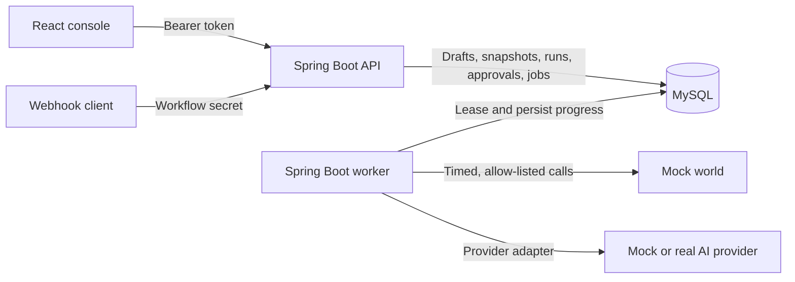
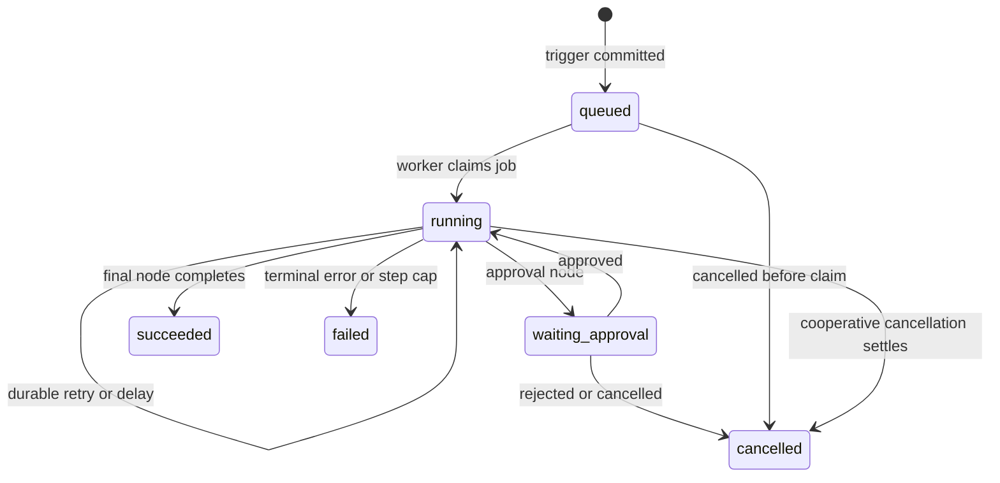

# Relay — AI Workflow Orchestrator

Relay is a durable workflow orchestration platform for operations flows that combine deterministic work, AI classification, human approval, and sensitive side effects. Workflows are defined as typed node graphs, published as immutable runnable definitions, accepted through manual or webhook triggers, and executed asynchronously by a recoverable worker.

The backend currently supports workflow authoring and publication, durable triggers, retries and delays, deterministic and AI nodes, approval gates, cancellation, idempotent mock-world actions, crash recovery, and persisted step caps. The React console shell and protected API connection are implemented; run/trace APIs and data-driven console screens are the next phase.

## Highlights

- Draft → publish workflow lifecycle with immutable published definitions and per-run snapshots
- Manual and secret-protected webhook triggers
- MySQL-backed durable queue with leases, fencing, retry backoff, and restart recovery
- Typed nodes for conditions, delays, HTTP calls, notifications, mock-world order actions, AI, and approvals
- Strict AI JSON parsing and JSON Schema validation before downstream use
- Engine-enforced human approval for sensitive actions—model output cannot grant approval
- Stable per-action idempotency keys across retries and uncertain crash recovery
- Persisted run-wide step cap for bounded loops
- Separate API and single-worker processes built from one Spring Boot application
- Local mock world, mock AI provider, four seeded workflows, and automated unit/integration tests

## Current status

| Area | Status |
| --- | --- |
| Workflow drafts, validation, publication, and seed loading | Implemented and tested |
| Manual/webhook acceptance and durable execution | Implemented and tested |
| Deterministic nodes, retries, delays, and crash recovery | Implemented and tested |
| AI nodes, schema enforcement, approvals, and cancellation | Implemented and tested |
| Workflow console shell and protected API connection | Implemented |
| Run list/detail and redacted trace APIs | Planned next |
| Data-driven workflow, run, trace, and approval screens | Planned |
| Final end-to-end verification report and demo package | Planned |

See [PROJECT_PLAN.md](PROJECT_PLAN.md) for the live checklist and recorded verification results.

## Architecture



The API owns authentication, workflow management, publication, trigger acceptance, approvals, cancellation, migrations, and seed loading. The non-web worker claims committed jobs and executes one workflow step at a time. Both processes share the same database and executable JAR; `RELAY_MODE` selects their role. Only one active worker is supported.

More detail:

- [Architecture and transaction boundaries](docs/ARCHITECTURE.md)
- [Data model](docs/DATA_MODEL.md)
- [Workflow semantics](docs/WORKFLOW_SEMANTICS.md)
- [Recovery and lease protocol](docs/RECOVERY.md)
- [Console design](docs/CONSOLE.md)

## Technology

| Layer | Technology |
| --- | --- |
| Backend | Java 21, Spring Boot 4.1, Spring MVC, Spring Data JPA, Spring Security |
| Persistence | MySQL 8.4, Flyway, native SQL where queue fencing requires affected-row checks |
| Frontend | React 19, TypeScript 7, Vite 8, React Router |
| Testing | JUnit, Testcontainers, Node test runner, Playwright |
| Local services | Docker Compose, Python mock services |

Exact pinned versions and compatibility notes are in [docs/SETUP.md](docs/SETUP.md).

## Prerequisites

- JDK 21
- Docker with Docker Compose
- Node.js 24.21 and npm 11.19 (the frontend includes `.nvmrc`)
- Python 3.9 or newer

All commands below run from the repository root unless noted. The backend does not automatically load `.env` files.

## Quick start

### 1. Build the backend

```sh
cd backend
./gradlew --gradle-user-home .gradle/user-home --no-daemon test bootJar
cd ..
```

### 2. Start MySQL

```sh
python3 scripts/init_mysql_secrets.py
docker compose config --quiet
docker compose up -d --wait --wait-timeout 180
docker compose ps
```

The initializer creates ignored local password files under `local-data/mysql/`. Re-running it preserves existing values. The `relay_mysql_data` volume persists database data across ordinary `docker compose down` and restart operations.

### 3. Start the API

In a new terminal:

```sh
export RELAY_DB_URL=jdbc:mysql://localhost:3306/relay
export RELAY_DB_USER=relay
export RELAY_DB_PASSWORD="$(cat local-data/mysql/password)"
read -r -s RELAY_DEMO_TOKEN
export RELAY_DEMO_TOKEN
RELAY_MODE=api java -jar backend/build/libs/relay-backend-0.1.0.jar
```

Enter a private local management token at the silent prompt. API startup applies Flyway migrations and, by default, inserts any missing canonical seed workflows without overwriting existing workflows.

Verify the process from another terminal:

```sh
curl --max-time 5 http://127.0.0.1:8080/actuator/health/liveness
curl --max-time 5 http://127.0.0.1:8080/actuator/health/readiness
```

### 4. Start the local services

The mock world is required by notification and order-action nodes:

```sh
python3 scripts/run_mock.py world
```

For mock AI transport and failure testing, start the supplied provider in another terminal:

```sh
python3 scripts/run_mock.py provider
```

The supplied AI mock intentionally returns prose, so schema-constrained AI workflows fail after the bounded repair attempt. Successful AI branching is covered by controlled fixtures; a real provider can be configured separately.

### 5. Start the worker

In another terminal:

```sh
export RELAY_DB_URL=jdbc:mysql://localhost:3306/relay
export RELAY_DB_USER=relay
export RELAY_DB_PASSWORD="$(cat local-data/mysql/password)"
RELAY_MODE=worker java -jar backend/build/libs/relay-backend-0.1.0.jar
```

The worker is a non-web process. Keep exactly one worker active, and stop the old process before testing restart recovery.

### 6. Start the console

```sh
cd frontend
source ~/.nvm/nvm.sh
nvm use
npm ci
cp -n .env.example .env.local
npm run dev
```

Open [http://127.0.0.1:5173/console/workflows](http://127.0.0.1:5173/console/workflows). Enter the same management token used by the API. The connection check uses the real workflow list; the domain pages are still placeholders pending Phase 6.

## Configuration

Copying an example file is optional; export settings into each process environment. Never place database passwords, management tokens, or provider keys in `VITE_*` variables—Vite values are public browser configuration.

| Variable | Process | Purpose / default |
| --- | --- | --- |
| `RELAY_MODE` | API, worker | Required: `api` or `worker` |
| `RELAY_DB_URL` | API, worker | Required MySQL JDBC URL |
| `RELAY_DB_USER` | API, worker | Required database user |
| `RELAY_DB_PASSWORD` | API, worker | Required database password |
| `RELAY_DEMO_TOKEN` | API | Required bearer token for management routes |
| `RELAY_API_PORT` | API | Loopback API port; default `8080` |
| `RELAY_ALLOWED_ORIGINS` | API | Exact browser origins; default `http://localhost:5173` |
| `RELAY_LOAD_SEEDS` | API | Insert missing canonical seeds; default `true` |
| `MOCK_WORLD_URL` | Worker | Mock-world origin; default `http://localhost:9210` |
| `RELAY_HTTP_ALLOWED_ORIGINS` | Worker | Exact allow-list for workflow HTTP destinations |
| `RELAY_AI_MODE` | Worker | `mock-http`, `openai`, or `openrouter` |
| `RELAY_AI_BASE_URL` | Worker | Used only by the local mock adapter |
| `RELAY_AI_MODEL` | Worker | Provider model identifier |
| `RELAY_AI_API_KEY` | Worker | Server-side provider credential |
| `VITE_RELAY_API_BASE_URL` | Frontend | Public API origin only |

Timeout, lease, polling, and retry settings are documented in [backend/.env.example](backend/.env.example) and [docs/RECOVERY.md](docs/RECOVERY.md). Real-provider setup is documented in [docs/SETUP.md](docs/SETUP.md#phase5-ai-and-human-control); ordinary development and tests do not require a billable provider call.

## API overview

Management routes require `Authorization: Bearer <RELAY_DEMO_TOKEN>`. Webhooks use `X-Relay-Secret` instead. Health probes are public. The authoritative request/response schemas, validation rules, examples, status codes, and edge cases are in [API_DOCUMENTATION.md](API_DOCUMENTATION.md).

| Method | Route | Purpose |
| --- | --- | --- |
| `GET` | `/actuator/health/liveness` | Process liveness |
| `GET` | `/actuator/health/readiness` | Database-backed readiness |
| `GET` / `POST` | `/workflows` | List workflows / create a draft |
| `GET` / `PUT` | `/workflows/{workflowId}` | Read / replace a draft |
| `POST` | `/workflows/{workflowId}/publish` | Validate and freeze a definition |
| `POST` | `/workflows/{workflowId}/trigger` | Accept a manual run |
| `POST` | `/hooks/{workflowId}` | Accept a secret-protected webhook run |
| `GET` | `/approvals?status=pending` | List approvals by status |
| `POST` | `/approvals/{id}/approve` | Approve and asynchronously resume |
| `POST` | `/approvals/{id}/reject` | Reject and cancel the run |
| `POST` | `/runs/{id}/cancel` | Cancel or request cooperative cancellation |

Example—list the seeded workflows after exporting the API token in the calling shell:

```sh
curl http://127.0.0.1:8080/workflows \
  -H "Authorization: Bearer $RELAY_DEMO_TOKEN"
```

Example—trigger the bounded runaway-loop seed:

```sh
curl -i -X POST http://127.0.0.1:8080/workflows/wf_runaway/trigger \
  -H "Authorization: Bearer $RELAY_DEMO_TOKEN" \
  -H 'Content-Type: application/json' \
  --data '{"input":{"order_id":"ord_2001"}}'
```

Trigger acceptance returns `202` with a run ID after the run snapshot and first queue job commit atomically. The run list/detail endpoints are not implemented yet; use the documented database queries in [docs/SETUP.md](docs/SETUP.md#phase-4-deterministic-worker) during local development.

## Seeded workflows

| ID | Trigger | Scenario |
| --- | --- | --- |
| `wf_support_triage` | Webhook | AI classifies support input; refund requests require approval before the order action, while other classifications notify support |
| `wf_expense_approval` | Webhook | Deterministic amount branch; expenses above 100 wait for finance approval |
| `wf_slow_fulfillment` | Manual | Confirmation → 20-second durable delay → shipment → shipped notification; used for kill-and-resume verification |
| `wf_runaway` | Manual | Polls an order in a loop until the persisted 12-step cap fails the run |

Seed definitions are in [backend/src/main/resources/catalog/seed_workflows.json](backend/src/main/resources/catalog/seed_workflows.json). Mock endpoints and fault controls are described in [docs/MOCKS.md](docs/MOCKS.md).

## Run state model



Delay and retry jobs retain the public `running` status and store their specific wait reason and due time separately. Every logical node visit has a persisted sequence number; each attempt is stored separately. Retries and worker restarts do not allocate another logical step, while loop visits do. Full transition rules and race precedence are in [docs/STATE_TRANSITIONS.md](docs/STATE_TRANSITIONS.md).

## Crash recovery and side-effect safety

Relay does not claim universal exactly-once delivery over HTTP. It combines durable, at-least-once execution with receiver-side idempotency:

1. The API atomically commits a run, immutable definition snapshot, frozen execution policy, and initial job before returning `202`.
2. The worker claims jobs with an owner, lease, and generation fence. External calls occur outside database transactions.
3. Before a side effect, Relay persists the resolved request and a stable key shaped as `{run_id}:{step_sequence}`.
4. Step completion and successor scheduling commit atomically and only while the worker still owns the lease.
5. If a worker dies after the receiver acted but before local completion committed, recovery marks the abandoned attempt uncertain and replays the same request with the same key.
6. The supplied mock world deduplicates that key, producing one intended effect. A receiver that ignores idempotency keys can still duplicate an effect in this crash window.

Delays and retry deadlines live in MySQL rather than sleeping worker threads. Approval waits hold no worker lease. A persisted step counter prevents restart or retry from resetting loop limits.

## Testing

Backend unit tests and executable JAR:

```sh
cd backend
./gradlew --gradle-user-home .gradle/user-home --no-daemon --offline test bootJar
```

Backend integration suite with disposable MySQL containers (Docker required):

```sh
cd backend
./gradlew --gradle-user-home .gradle/user-home --no-daemon --offline test bootJar testcontainersTest
```

Frontend checks:

```sh
cd frontend
npm test
npm run build
npx playwright install chromium
npm run test:browser
```

The real-provider probe is explicit, synthetic, and potentially billable; it is excluded from normal test tasks. Executed test evidence is retained in [docs/phase4-verification.txt](docs/phase4-verification.txt), [docs/phase5-verification.txt](docs/phase5-verification.txt), and the other `docs/*-verification.txt` files.

## Project layout

```text
.
├── backend/                 Spring Boot API, worker, migrations, catalog, tests
├── frontend/                React/Vite console shell and browser tests
├── scripts/                 Setup, consistency, mock, and AI configuration tools
├── docs/                    Design documents and executed verification evidence
├── compose.yaml             Local MySQL service
├── API_DOCUMENTATION.md     Complete implemented API contract
└── PROJECT_PLAN.md          Ordered roadmap, task records, and current status
```

## Known limitations

- Run list/detail and redacted trace endpoints are not implemented yet.
- Console workflow, run, trace, and approval pages are placeholders; only the shell and API access check are active.
- The supported deployment has one active worker. Concurrent worker operation is outside the capstone scope.
- Scheduled/cron triggers, parallel branches, numbered workflow versions, multi-tenancy, and a graphical workflow builder are outside scope.
- Arbitrary external HTTP receivers cannot be guaranteed exactly once unless they honor Relay's idempotency key.
- The final smoke-test report, clean-start verification, complete console demonstration, and submission package remain Phase 7–9 work.

## Shutdown and local reset

Stop API, worker, mocks, and frontend with `Ctrl-C`. Preserve database data with:

```sh
docker compose down
```

To intentionally delete the local Relay database volume, first stop the API and worker, then run:

```sh
docker compose down --volumes
```

This reset is destructive; local secret files remain. See [docs/SETUP.md](docs/SETUP.md#mysql-compose--task-26) for recovery and troubleshooting guidance.

## Documentation

- [Requirements traceability](docs/REQUIREMENTS.md)
- [MVP and scope](docs/MVP.md)
- [API reference](API_DOCUMENTATION.md)
- [Architecture](docs/ARCHITECTURE.md)
- [Data model](docs/DATA_MODEL.md)
- [State transitions](docs/STATE_TRANSITIONS.md)
- [Workflow semantics](docs/WORKFLOW_SEMANTICS.md)
- [Recovery design](docs/RECOVERY.md)
- [Local setup](docs/SETUP.md)
- [Mock services](docs/MOCKS.md)
- [Roadmap and completion log](PROJECT_PLAN.md)
