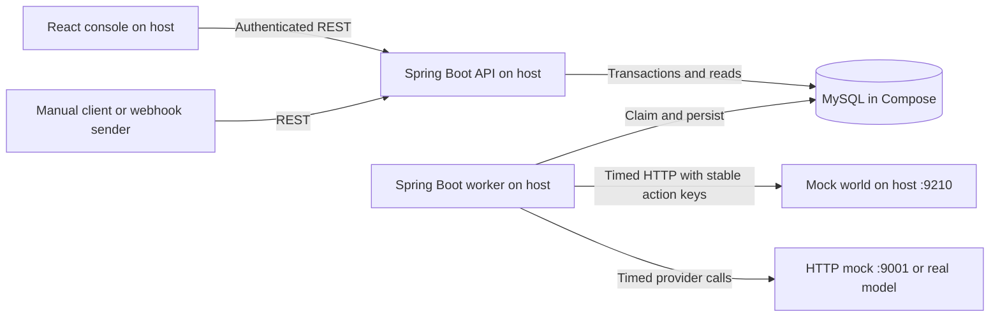

# Relay architecture

Task 1.4, 2026-09-25. **Architecture design; tasks 2.4–2.5 implement the backend/health scaffold and API/worker bootstrap, not the execution architecture.** Decisions here select implementation structure, not new product features. Dependency versions are selected in [setup task 2.2](SETUP.md); runtime verification remains in the scaffold tasks.

Sources: [requirements](REQUIREMENTS.md), [MVP](MVP.md), [PDF evidence](source-review/brief.txt), [API contract](source-review/pack/docs/API_CONTRACT.md), [data/recovery contract](source-review/pack/docs/DATA_MODEL.md), [catalog](source-review/pack/data/node_catalog.json), [implementation guide](source-review/pack/docs/IMPLEMENTATION_GUIDE.md), [evaluation guide](source-review/pack/docs/EVALUATION_GUIDE.md), and [inspection findings](CAPSTONE_PACK_REVIEW.md). R/V identifiers refer to REQUIREMENTS; task numbers refer to [PROJECT_PLAN](../PROJECT_PLAN.md).

## Decisions and rationale

| Decision | Selected design | Reason and implementation owner |
| --- | --- | --- |
| A01 | Java, Spring Boot, Spring Data JPA, MySQL; one Gradle backend artifact with mutually exclusive api and worker launch modes. | User-required stack. Shared domain code keeps HTTP and background transitions consistent; separate processes make worker-kill evidence unambiguous. Tasks 2.4, 2.5. |
| A02 | MySQL stores domain state and durable jobs in the same database; one active worker process, one in-flight node execution at a time. | Run/queue and completion/next-work changes can commit together. Avoid an additional broker and cross-system transaction gap. JPA handles normal persistence; a narrowly scoped native SQL queue adapter may handle claiming. Tasks 3.1, 4.3, 4.5; locks/leases defined in task 1.8 [recovery protocol](RECOVERY.md). |
| A03 | Persist due times for delays and retries; release execution capacity while waiting. | Restart preserves scheduling and other runnable jobs can proceed; no sleeping worker thread per delay or approval. Tasks 4.8, 4.12, 5.1. |
| A04 | Flyway owns ordered migrations; API startup applies them, worker validates schema and never migrates or seeds. | One documented startup owner and repeatable schema evolution. Seed loader is an explicit local operation after migration and before normal execution, using shared validation services. Tasks 2.4, 3.1, 3.9. |
| A05 | React + TypeScript + Vite read-and-operate console; refresh run state by polling. | Fits workflow/run/approval views without a graphical editor, streaming transport or extra backend service. Tasks 2.7, 6.3–6.12; detailed screens in task 1.9 [console design](CONSOLE.md). |
| A06 | Local API, worker, frontend and Python mocks run on the host; Docker Compose supplies MySQL with persistent storage and a loopback-published port. | The unchanged seeds use localhost:9210; host execution makes that address reach the mock world directly. Backend containerization is not required for this local deliverable. Tasks 2.6, 2.8, 2.9. |
| A07 | Provider port separates engine logic from canned JSON tests, supplied HTTP mock, and one real free-tier/local model adapter. | Reliable engine tests do not require credentials; real model remains necessary for AI demo. Tasks 5.5, 5.9. |

These choices supersede the earlier proposed defaults where covered. They require implementation tests; they are not claims about an existing build. No cloud infrastructure, broker, multi-worker product, compiler or real email/chat connector is introduced.

## Runtime topology



There is no API-to-worker HTTP call. Committed MySQL jobs are the handoff. API handlers never execute nodes or call the model/mock world. The console accesses only the API, never the database or worker. Worker mode has no public application HTTP routes. A process must select exactly one launch mode; ambiguous or absent mode is a startup configuration error.

Use local API port 8080 and frontend port 5173 as intended setup defaults, configurable in Phase 2. In development, the frontend dev-server proxy forwards API requests with unchanged paths; a single configured API origin is used when a proxy is unavailable. Only configured frontend origins are allowed by API CORS. Browser API requests carry the user-entered demo token, kept in memory; no shared token or provider key is embedded in the frontend bundle. Reload may require token entry again. Production hosting is outside this task and the local-only workflow.

Mock-world URL is http://localhost:9210; supplied HTTP mock is http://localhost:9001. Only MySQL traffic crosses the Compose boundary. Changing MOCK_WORLD_URL affects notify/order adapters, not literal http_request URLs in saved definitions. For the seeded demo keep the mock world on 9210; if that port is occupied, resolve the conflict rather than silently rewriting seed definitions. This resolves the networking part of D04.

## Internal module boundaries

Directories backend/, frontend/, docs/ and scripts/ now exist (task 2.3); backend contains the tasks 2.4–2.5 scaffold/bootstrap and frontend the task 2.7 React/Vite shell, placeholder routes and API transport. See [setup](SETUP.md) for local configuration boundaries. Backend starts as one Gradle module with package boundaries; no microservices or separately deployed internal modules.

| Package/component | Owns | Dependencies and restrictions |
| --- | --- | --- |
| bootstrap | Mode/config validation, dependency wiring, lifecycle, migration/seed entry points. | Wires adapters; enables controllers only in api mode and polling only in worker mode. |
| api | Controllers, request/response DTOs, demo-token and webhook authentication, validation/error mapping. | Calls application services; never returns JPA entities or raw stored snapshots directly. |
| application | Workflow create/edit/publish, run acceptance/cancel, approval decision, trace queries and transaction boundaries. | Uses domain and persistence ports. API and worker share transition rules here; no outbound network inside its database transactions. |
| domain | Catalog-driven definitions, pure publish validation, template resolution, schema-validation boundary, transition/gate/cap rules. | Independent of HTTP controllers, JPA entities and provider SDKs. Exact semantics assigned to 1.6–1.7. |
| engine | Worker orchestration, node dispatch, step preparation, retry/delay planning and recovery coordination. | Calls domain rules and application/persistence ports; dispatches only the run snapshot. It cannot edit published workflows or fabricate human decisions. |
| nodes | Seven handlers below and typed execution outcomes: completed, wait, retry or failure. | Handlers do not independently advance the graph or write jobs. Engine owns persistence/advancement. |
| persistence | JPA mappings/repositories, domain mapping, durable queue SQL and ownership checks. | MySQL is source of truth; transaction participants use the same database. Migrations/constraints planned in 1.5. |
| integrations | HTTP transport, mock-world adapters, AI provider implementations. | Receives already-resolved requests and engine-owned keys. Returns result/error/usage; no workflow-state or approval writes. |
| trace | Safe projections and redaction for API, console and diagnostic logging. | Reads persisted state; cannot drive execution from redacted presentation data. |

Dependency direction is api/engine → application/domain ports ← persistence/integrations adapters, wired by bootstrap. Tests can supply provider/clock/transport fakes without starting a web server. Domain rules are reused at publication and execution where applicable; publication checks do not replace runtime approval or cap enforcement.

### Node ownership

| Node | Handler responsibility | Execution boundary |
| --- | --- | --- |
| `http_request` | Resolve catalog URL/headers/body; timed HTTP request, non-GET key. | Integration transport; persist resolved request before side effect. Configured destination policy must permit supplied loopback URLs; validate resolved destinations and redirects before sending. Detailed policy in 4.9. |
| `condition` | Compare resolved left/right with catalog op; return result and chosen edge. | Pure domain rule; invalid numeric operands fail clearly. |
| `delay` | Calculate/persist a due time and yield. | Durable queue scheduling; restart uses existing due time. |
| `notify` | Email or chat request to mock world. | Keyed/timed adapter; chat maps params.to to channel. |
| `ai` | Resolve prompt, call provider, validate JSON against output_schema, one repair with validation error. | Unvalidated output cannot enter node-output context; second invalid response fails. Transport retries and validation repair are distinct budgets. |
| `approval` | Resolve message, create pending human request and pause. | Atomic wait state; no worker held while awaiting decision. |
| `order_action` | Refund/replacement through mock-world adapter. | Engine must first verify approved human evidence earlier in this run; timed keyed side effect. Omitted refund amount means full refund. |

Catalog params, output types and template flags remain unchanged. Provider responses never become executable code, graph edits, approval records or destination instructions. Only validated AI data can influence declared workflow templates/branches. Run-wide approval scope follows the catalog, not a new action-specific permission model.

## API responsibility map

These are the eight existing fixed planned routes, not implemented endpoints. Request/error shapes stay in REQUIREMENTS and the supplied API contract; [API_DOCUMENTATION.md](../API_DOCUMENTATION.md) will be updated with each implementation.

| Fixed route | Application service owner |
| --- | --- |
| `GET /workflows` | Workflow query |
| `POST /workflows` | Workflow draft command |
| `POST /workflows/{workflowId}/publish` | Publication validation and frozen-definition command |
| `POST /workflows/{workflowId}/trigger` | Run acceptance from input object |
| `POST /hooks/{workflowId}` | Workflow-secret validation and run acceptance from raw JSON |
| `GET /runs/{runId}` | Redacted run/trace query |
| `GET /approvals?status=pending` | Pending-approval query |
| `POST /approvals/{approvalId}/approve` | Authenticated human decision command |

The same API process owns required workflow detail/update, run listing, rejection and cancellation flows. Their flexible route choices and exact error vocabulary remain D02. Management/approval routes use Authorization bearer token; webhooks require only X-Relay-Secret and reject absent/wrong secrets with 401/403. The worker receives neither HTTP caller credentials nor permission from model text. A constant demo decider identity is sufficient but decision identity/time must be persisted.

## Persistence and execution flows

These are transaction boundaries to satisfy R02–R17, not the final schema or complete lease algorithm. Task 1.5 defines constraints/indexes; 1.6 defines transitions; 1.7 defines semantics; 1.8 defines the ownership protocol.

1. **Publish and accept:** validate catalog types/params/edges/entry while allowing loops; freeze publication separately from editable draft state. Trigger acceptance checks authorization and runnable publication, then commits run input, definition snapshot and initial job together. Respond with run ID only after commit. Worker offline is compatible with acceptance; database failure is not. Duplicate webhook requests create distinct runs. Lost HTTP acknowledgement after commit may leave a valid run; there is no inbound deduplication promise.
2. **Claim and prepare:** worker claims eligible committed work in a short transaction with recoverable ownership. Check terminal/cancelled state, persisted step cap and human approval evidence before dispatch. Allocate or reuse a logical execution/attempt; resolve from snapshot plus persisted outputs. Persist action inputs/key before network work. Repeated loop nodes get new sequence identities; retries reuse their existing identity.
3. **Call and complete:** network calls happen outside database transactions. Commit output/attempt metadata, step completion and next job (or terminal state) together, conditional on current ownership and run state. A stale worker cannot commit results or enqueue continuation. Database failure after an external effect leaves uncertain completion; recover using the same persisted input/key. Do not call the next node until completion commits.
4. **Wait and retry:** persist retry due time/attempt/error or delay due time, release work and reclaim when eligible. A waiting approval has no runnable continuation until decided. No in-memory timer is the source of truth. External calls have deadlines; retry exhaustion records failed state. Precise timeout/lease/renewal relationships are defined in [recovery protocol](RECOVERY.md), task 1.8.
5. **Decide or cancel:** decision command atomically checks pending approval and run state, records decider/time and queues one continuation or cancels on rejection. Cancellation closes pending approvals and prevents next-node scheduling; running work can finish its current step. Serialize decision/cancellation/completion conflicts on shared run state. Terminal cancellation returns 409. Task 1.6 defines race precedence and closed-approval representation in [state transitions](STATE_TRANSITIONS.md); no additional public run status is introduced.

Single-worker operation is a deployment constraint, not permission to ignore races between API and worker or delayed callbacks. A recovery lease/fencing check protects database ownership; it cannot retract a request already sent to a remote service. Before restarting after a kill drill, ensure the old worker is stopped. Recovery retries rely on receiver idempotency; concurrent live workers are excluded. The mock world's cache/ledger is volatile and overlapping-key calls are not proven atomic: keep the world alive and prevent worker overlap in the drill.

## Configuration contract

Task 2.5 binds RELAY_MODE, RELAY_DB_URL/USER/PASSWORD, RELAY_API_PORT, the API RELAY_DEMO_TOKEN startup prerequisite and RELAY_DB_TX_TIMEOUT_MS. Other names below remain selected design contracts for later binding. Secrets come from local environment or ignored local configuration; examples use placeholders. bootstrap validates required settings for its mode before serving/claiming. Errors identify the setting without printing its value. Phase 2 sets precise supported versions and numeric defaults; no undocumented fallback to a real provider.

| Setting/group | Consumer | Validation and secrecy |
| --- | --- | --- |
| RELAY_LOAD_SEEDS | API startup | Task3.9: true by default, exactly true/false; insert missing canonical Published workflows only. Existing IDs preserved; worker/scaffold never load seeds. |
| RELAY_MODE | bootstrap | Required api or worker, exactly one; worker has no public application listener. |
| RELAY_DB_URL, RELAY_DB_USER, RELAY_DB_PASSWORD | API, worker, seed operation | Required single-host MySQL JDBC URL/schema, no URL credentials/query/fragment; user and password nonempty. Password secret. Database unavailable → no readiness/claiming. |
| RELAY_API_PORT, RELAY_ALLOWED_ORIGINS | API | Valid local port and explicit console-origin list; implemented defaults8080 and http://localhost:5173; blank origin list disables cross-origin management access. No wildcard authenticated access. |
| RELAY_DEMO_TOKEN | API | Required nonempty management token; secret, never bundled in frontend or logged. Webhook authentication stays separate. |
| VITE_RELAY_API_BASE_URL | frontend | Public API address only, optional when using dev proxy; never a token or provider URL/key. |
| MOCK_WORLD_URL | worker | Absolute HTTP(S) origin; local demo http://localhost:9210. Adapter target for notify/order actions, not a seed-definition rewrite. |
| RELAY_HTTP_ALLOWED_ORIGINS | worker | Explicit resolved-target allowlist including mock origin for demo; matching/redirect details decided before 4.9. Provider transport has separate configured destination. |
| RELAY_AI_MODE, RELAY_AI_BASE_URL, RELAY_AI_MODEL, RELAY_AI_API_KEY | worker/provider adapter | Modes canned (test only), mock-http, real; validate settings needed by selected adapter. No silent fake fallback in real mode. Key secret; provider identity/model may appear in traces. |
| RELAY_HTTP_TIMEOUT_MS, RELAY_AI_TIMEOUT_MS | worker/transports | Positive finite deadlines for every call, including body reading; Defaults 10000/30000 ms in task 1.8; adapter verification in 4.9/5.9. |
| RELAY_JOB_POLL_MS, RELAY_JOB_LEASE_MS, RELAY_JOB_RENEW_MS, RELAY_DB_TX_TIMEOUT_MS | worker/queue | Defaults 250/60000/10000/5000 ms; bootstrap DB timeout range 1000..60000 ms; task 1.8 requires lease > renewal + longest call + two transaction deadlines. Unsafe configuration rejects. |
| RELAY_RETRY_MAX_ATTEMPTS, RELAY_RETRY_BASE_MS, RELAY_RETRY_MAX_MS | worker/retry policy | Defaults 3/1000/30000; task 1.8 defines shared transport/recovery budget plus one separate schema repair. Policy is frozen per run. |

Webhook secrets belong to workflow configuration and are verified server-side. Provider credentials are deployment configuration, not workflow fields. Restrict snapshots/resolved requests to backend persistence; response DTOs redact secrets instead of serializing raw entities. Maintain unredacted execution data only where necessary for deterministic retry, and separate its access from trace projections.

Trace records must retain resolved inputs, validated outputs, attempts, timing and AI usage. Prompt/payload data may contain personal information: use synthetic demo data, retain it in the local database until documented local reset, and avoid raw payload/prompt logging to console. Exact redaction rules/storage treatment, including user-supplied HTTP credentials, must be defined with data model and trace implementation; withholding all inputs is not a substitute for required traces. Logs should identify run/step/attempt and sanitized failure without secrets. No additional telemetry infrastructure is required.

## External services and startup

- **MySQL:** durable authoritative storage, including jobs. Compose volume persists across normal restarts; deletion/reset is explicit. API runs migrations first; worker refuses an incompatible schema. Library/database versions are selected in [setup](SETUP.md); Compose startup/reset commands are implemented in task 2.6 in that document; Java integration remains 2.9.
- **Mock world:** unchanged supplied server on 9210. Notify maps email to POST /email/send and chat to POST /chat/message; order actions use POST /orders/{id}/refund or /replacement. Seed HTTP nodes use GET /orders/{id} and POST /shipments. Every mutating action carries stable Idempotency-Key; GET does not require one. Keep ledger/cache alive during worker recovery.
- **AI:** unchanged supplied mock on 9001 exposes POST /v1/chat/completions and emits prose; use it for transport/invalid-output tests. Successful schema tests use canned JSON. Real model adapter choice/configuration is task 5.9; real demo verification remains required. Schema validation belongs to Relay even if a provider offers structured output.
- **Console:** local frontend calling API; no direct dependency on provider availability. API trace reads and human decisions can remain available while a provider is down, if MySQL is healthy.

Startup order: start MySQL and wait for connectivity; start API and complete migrations; explicitly load/validate the four published seeds idempotently; start mocks and configured provider; start one worker; start frontend. Normal shutdown stops new worker claims and allows a bounded in-flight completion; forced-kill recovery uses persisted state. Exact commands, readiness route and shutdown deadlines will be implemented/documented in Phase 2. Do not seed/reset automatically on every worker restart or overwrite edited workflows; duplicate-seed policy belongs to 3.9.

## Verification and remaining design work

All runtime cases below are planned, **not run**. Prerequisites and detailed expected outcomes are REQUIREMENTS V cases; implementation tasks must add actual tests and API documentation.

| Boundary | Input/action → expected result | Tasks / cases |
| --- | --- | --- |
| Request and persistence | Bad auth/input or missing resource → clear rejection with no work; valid trigger with stopped worker → persisted snapshot/job and prompt acceptance; DB failure → no false success. | 3.3, 4.1, 4.2; V02, V04, V05 |
| Snapshot and node rules | Edit/republish paused run, invalid template, cap boundary/loop → original snapshot, clear template failure, durable cap enforcement. | 3.8, 4.6, 4.13; V03, V07, V16 |
| Queue and external effect | Kill during delay or after keyed effect before persistence; duplicate delivery/stale completion → recover without lost continuation or duplicate intended effects. Assert three expected slow-workflow effects, not just checker exit. | 4.14, 7.3, 7.4; V06, V09, V10 |
| Service failure | World/model timeout/outage, recovery and exhaustion → bounded calls/backoff, persisted attempts and clear terminal error. | 4.12, 5.9, 7.5; V11 |
| Human and AI boundary | Competing decisions/cancel; wrong-run approval; forged model decision; invalid JSON twice → one consistent outcome, no unauthorized action and no invalid downstream output. | 5.10, 5.11; V12, V13, V14, V15, V17 |
| Trace/console and configuration | Secret-bearing errors, trace reads, wrong launch mode/missing config, clean local setup → redacted complete views, startup rejection for invalid config, unchanged seed URLs reachable. | 2.9, 6.12, 7.7, 7.8; V18, V19, V20, V22 |

D01 resolved on 2026-09-28 (preserve supplied graph and enforce approval gates): unconditional injection pause conflicts with the seed's conditional graph. No architecture component forces a branch or rewrites that seed. D02 flexible API/transition details stay with 1.6–1.7; D03 schema dialect/templates/cap/retry details with 1.6–1.8. D04 networking is settled here; Java repair/version selection are complete in 2.1–2.2; provider choice/credentials remain 5.9. Schema/constraints (1.5) and state machines (1.6) are documented in [data model](DATA_MODEL.md) and [state transitions](STATE_TRANSITIONS.md). Workflow semantics (1.7) are documented in [WORKFLOW_SEMANTICS.md](WORKFLOW_SEMANTICS.md); recovery protocol (1.8) is in [RECOVERY.md](RECOVERY.md); console layout (1.9) is in [CONSOLE.md](CONSOLE.md). Phase1 originally completed with D01 open; the user resolution above now governs. See Phase4/5 implementation updates below for current runtime status.

Excluded scope remains the MVP exclusions: cron execution, compiler, numbered versions, parallel branches, multi-worker operation, streaming UI, run wall-clock/token enforcement, real connectors and multi-tenancy. Persist optional seed limits without enforcing them; per-call deadlines and usage recording remain required. All work stays local: never push or publish; publication is a manual user task.

Document checks from project root:

```sh
python3 scripts/check_architecture.py
python3 scripts/check_requirements.py
python3 scripts/check_mvp.py
python3 scripts/check_capstone_review.py
```

Expected: links/references, route/handler ownership and configuration consistency pass; invalid-copy cases fail; existing source checks stay green. Manual walkthroughs supplement structural checks; no document checker proves crash recovery or transaction safety. Actual results: [architecture-verification.txt](architecture-verification.txt).

Implementation update (Phase4): trigger acceptance uses JPA and the shared transaction
manager; the durable engine uses explicit JdbcTemplate SQL through that manager for
run-first locks, lease predicates and atomic outcome writes. This preserves Java/Spring
Boot/JPA/MySQL while making fencing and affected-row checks explicit. Worker dispatch is
sequential with a separate lease-renewal thread. Transport uses the JDK21 HTTP client with
hidden resends disabled, per-call total deadlines and bounded bodies. API/worker continue
to run as separate processes. No new dependency, schema migration, broker or additional
service is introduced. See [execution evidence](phase4-verification.txt); Phase5 handlers
and Phase6 run-read/console features remain pending.


### Phase5 implementation update (2026-09-28)

AI and approval execution and human control are now implemented. The worker persists
pending approval/step/run/job state atomically and releases ownership. Human decisions
serialize with cancellation and worker results on the run lock. Approved earlier same-run
human evidence is checked on every sensitive attempt; AI output cannot create that evidence.
Strict output JSON/schema validation permits one durable corrective request. Transport and
recovery use the original shared retry budget, provider/model and frozen request; lost
usage is explicitly incomplete. Cancellation prevents new dispatch/retry/repair/successors
and preserves a known in-flight result before cancelling the run.

D01 was clarified by the user on2026-09-28: retain the supplied graph, refund_request pauses
for approval, complaint/question follows notification, and always block unapproved sensitive
actions. Earlier design-stage statements about an open discrepancy are historical. No
canonical pack bytes or seed graphs were changed. See [API contracts](../API_DOCUMENTATION.md),
[setup](SETUP.md) and [actual evidence](phase5-verification.txt).
Run-read/trace projections and interactive console data remain Phase6.
