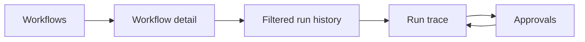

# Relay console design

Task 1.9, 2026-09-25. **Design baseline; task 2.7 implements the responsive shell, five placeholder browser routes and API transport. Task3.4 implements authentication access; task3.6 supplies backend workflow CRUD. Tasks6.3–6.12 (2026-09-28) implement all five views, polling, decisions and cancellation per this design; demo steps are in [CONSOLE_DEMO.md](CONSOLE_DEMO.md).** Sources: [PDF evidence](source-review/brief.txt), [problem statement](source-review/pack/RELAY_PROBLEM_STATEMENT.md) Scope/Must Have 8, [API contract](source-review/pack/docs/API_CONTRACT.md), [catalog](source-review/pack/data/node_catalog.json), [seeds](source-review/pack/data/seed_workflows.json), [requirements](REQUIREMENTS.md), [MVP](MVP.md), [architecture](ARCHITECTURE.md), [data model](DATA_MODEL.md), [state transitions](STATE_TRANSITIONS.md), [workflow semantics](WORKFLOW_SEMANTICS.md), [recovery](RECOVERY.md), [roadmap](../PROJECT_PLAN.md).

## Scope and navigation

React + TypeScript + Vite, simple tables, details and buttons. Three navigation items: Workflows, Runs, Approvals. Root opens Workflows. Five client-side views below use `/console` to avoid collisions with API paths on a shared origin. These are planned browser paths, not new API routes. Implement direct-load/back/forward support in 2.7/6.3 with the development proxy forwarding only API paths.

| Screen | Browser path | Purpose / implementation owner |
| --- | --- | --- |
| U01 | /console/workflows | Workflow list and draft/published visibility; 6.4. |
| U02 | /console/workflows/:workflowId | Read-only definition and workflow-scoped run history link; 6.5, 6.6. |
| U03 | /console/runs | Global or workflow-filtered history; 6.8. |
| U04 | /console/runs/:runId | Run summary, ordered trace, step/attempt inspection and cancellation; 6.8, 6.9. |
| U05 | /console/approvals | Pending requests with run context and approve/reject; 6.10. |

Creation, editing, publishing and manual triggering remain API-driven. Link to the project API/demo instructions; no authoring form, JSON editor, graphical builder, compile UI or trigger button. Run cancellation exposes the existing required cancellation behavior, not a new backend feature. No dashboards/analytics, bulk decisions, streaming, failed-run replay, secret editor, role administration or external connectors.

Navigation keeps its current filter/selection when going back. IDs in links are encoded as path segments; never interpolate untrusted IDs into HTML or build URLs by string concatenation without encoding. Workflow view uses current stored definition; run trace uses its own accepted snapshot. A workflow edit cannot retroactively change the run's title, node list or branch labels.

## Access and shared shell

A token-entry panel precedes protected content. Use a labeled password input and Connect button; submit with Enter. Send Authorization: Bearer <demo-token> only to the configured Relay API origin. Validate it through the first protected list read; connection success means that read succeeded, not that worker/provider are healthy. No token-check endpoint is added just for this screen.

**Keep the demo token in memory only.** Never place it in URL, localStorage, sessionStorage, browser history, analytics or logs. Reload requires entry again. Disconnect clears token, cached protected data, polling and pending requests, then returns focus to token input. A protected 401 clears the same state and asks for a token; 403 shows access denied without inventing roles. Other failures do not label a token invalid. A request from a prior token/session must not repopulate the new session's cache.

Shared shell: product name Relay, primary navigation with current item identified, connection/disconnect control, page heading and per-view Refresh. Display refresh failures and last successful refresh time beside relevant content. Do not show a green worker-health indicator based on API reachability. Status labels use text as well as color. Times display UTC with explicit UTC label and full timestamp available in detail; null timestamps display “Not started” or “Not finished,” not epoch dates. Use real buttons/links, visible focus, semantic headings and readable contrast; exact visual styling remains frontend implementation.

## Workflow views

U01 lists name, ID, status, trigger type and updated time. Name/ID links to U02. Empty: “No workflows yet” with API setup/seed instructions. No misleading “Create” button. Loading has labeled progress; first-load failure has an explicit Retry. Preserve valid rows on refresh failure with a stale-data notice. Avoid fetching every full definition just to render a list.

U02 shows name/ID/description, draft/published status, trigger type, entry, max_steps, timestamps and a table of nodes (ID, type, parameters and edge targets). Show nonsecret parameters in expandable read-only text/JSON. Each edge links to its target node within the same definition; explicit null is “End.” Nodes remain in definition order and entry is marked; this is not presented as execution order. Unknown/invalid draft node types and dangling edges display their stored values safely, not a broken renderer. Recognized types include http_request, condition, delay, notify, ai, approval and order_action.

Default to current draft definition with a clear “Draft definition” label when status draft. If an older frozen publication exists, offer a read-only “Last published definition” view labeled “New triggers require republishing the draft.” When status published, default to the frozen publication and avoid redundant identical tabs. This is two stored definitions, not numbered version history. Optional timeout_seconds/max_ai_tokens may appear under definition limits labeled “Stored; not enforced.” Do not draw progress bars against them. Hide webhook secret values; show only “Secret configured” from a safe projection, never copy/reveal them. Link “View runs” to U03 filtered by workflow ID. No client-side reconstruction of raw secret-bearing snapshots.

## Run history and status presentation

U03 lists run ID, workflow name/ID, status, trigger type, accepted/start/finish time and logical step count/cap. Show newest accepted first with run ID as stable tie-breaker. Filters: workflow and the six run statuses, plus “All.” Filter state belongs in nonsecret URL query parameters so back/forward works; invalid filter values produce a visible filter error/reset, not an accidental unfiltered request. Opening a row goes to U04. An API-returned run ID can be opened directly by browser URL even before the list refreshes.

Lists use pages of 25 as the intended UI default with Next/Previous and clear end-of-list state; backend cursor/query names and maximum limits are finalized in 3.6/6.1/5.2. Filtering/pagination must occur server-side for growing histories, not only against the current page. No invented total count if the API does not supply one. Retain the current page during refresh; refreshing the first page can reveal newly accepted runs. Changing a filter resets paging. Pending lists can shrink after decisions; if a page becomes empty, return to a prior valid page or the first page and explain the change. The API must document ordering/continuation semantics before these controls are implemented.

| Run status | Visible label and meaning |
| --- | --- |
| queued | Queued — accepted durably; no node has started. |
| running | Running — may currently execute, wait for delay, or wait before a retry; use step detail for the distinction. |
| waiting_approval | Waiting for approval — link to the matching request in Approvals. |
| succeeded | Succeeded — completed its final path; terminal. |
| failed | Failed — show recorded error/cap reason and failing node where known; terminal. |
| cancelled | Cancelled — distinguish operator cancellation from rejected approval using recorded evidence; terminal. |

Never infer success from HTTP 2xx on a trigger, decision or cancel command. “Cancellation requested” is an additional notice on a still-running run, not a seventh status. A paused delay is not waiting_approval. A run can fail at admission with 12 successful rows and no thirteenth row; show the run-level cap reason without inventing a failed step.

## Run trace and step inspection

U04 begins with run ID, workflow name/ID from snapshot, status, accepted/start/finish times, cancellation request/reason, error, steps_executed/max_steps and known AI usage. Show the immutable redacted snapshot context so later draft changes cannot alter interpretation. Unknown usage is “Unavailable”; a known partial aggregate is labeled “Known usage; incomplete.” A reported zero stays zero. Do not invent cost accounting.

| Trace field | Presentation |
| --- | --- |
| sequence | Ascending logical execution order; row identity is run ID plus sequence, never node ID alone. |
| node_id, node_type | Node label/type from snapshot; repeat rows for loop visits. |
| status, wait_reason | Text label: running, waiting (delay/retry/approval), succeeded, failed or cancelled. |
| resolved_input | Redacted resolved parameters; show “Not resolved” if absent, JSON null if explicitly present. |
| output | Validated successful output where present; unavailable for unfinished/cancelled work without outcome. |
| attempts | Ordered attempt number, cause, status, error, start/finish/duration and provider/model metadata. Zero attempts is valid for admission/resolution/gate failures. |
| timestamps, duration_ms | Logical step timing including wait; each attempt timing separately; do not sum attempt time and call it total elapsed time. |
| error | Sanitized code/message and node/cap context; preserve failed attempts even if later attempt succeeded. |
| tokens_prompt, tokens_completion | Known per-step/per-attempt counts and completeness; null is not zero. |
| selected_next_node_id | Committed branch/successor, “End” only for a completed final path; not inferred from current workflow. |
| resume_at, retry_due_at | Recorded delay/retry deadline, UTC; countdown is descriptive and never executes a node or proves completion. |
| approval | ID, message, status, decision maker/time or administrative closure reason, linked to same-run request. |
| idempotency_key | Safe engine-generated action key as read-only diagnostic data; retries show the same key, loop visits distinct keys. |

Rows expand into Input, Output, Attempts and relevant decision/timing data; plain accessible sections suffice, no nested navigation application is needed. Attempt uncertain is labeled “Outcome unknown — the remote call may have completed.” NULL duration for uncertain attempts remains “Unknown.” Invalid AI responses, if retained and safely exposed by the trace DTO, belong to their failed attempt, never the successful output panel. Sensitive response text receives the same redaction policy as inputs.

Trace retrieval must provide all logical steps and attempts through documented pages/chunks if necessary; never silently truncate or hide later loop rows. The fixed GET run response still contains status and steps with node_id/status as required. Further pagination/projection fields are 6.1/6.2 design obligations, not assumed endpoints. Keep selected sequence/attempt stable across refresh, and append/update rows by identity without collapsing an inspection. When first opened, reveal the active/failed row if present; subsequent polling does not move focus or scroll.

Cancel run is available only for queued/running/waiting_approval from last confirmed data. Inline confirmation states “Stop future work; the current step may finish.” Confirm sends one command; show in-progress then actual returned/refetched state. If still running with cancel request, disable another cancel while showing request time; no claim of remote rollback. Terminal-run 409 causes refetch and a state-changed message. Cancellation can close pending approval; trace refresh then shows closed, not rejected. No delete/undo/restart action.

## Approval inbox and decisions

U05 lists pending approvals oldest first (created_at then ID), with workflow/run ID, node ID/sequence, request time and rendered message. Message is untrusted plain text. Each item links to run trace; allow an existing approval ID in the URL to focus its item. If it is absent from the current page, retrieve/find through the implemented projection rather than conclude it was decided. No bulk actions, amount editing, delegation or reason field requirement.

Approve and Reject open a compact inline confirmation with selected run/node/message. Reject explicitly says it ends this run cancelled. Confirm/cancel buttons have accessible names tied to that request; Escape cancels the confirmation. Confirm disables both actions for that approval while its request is outstanding. No optimistic removal or invented decision. On confirmed success, show the recorded result/decider/time, refresh inbox and run, and offer View run. Final approval may immediately succeed; otherwise the run resumes. Return focus to the result notice or next item after removal, not the document body.

**Never automatically retry a mutation.** A timeout, aborted browser request or dropped connection after submission may mean the decision committed. Preserve “Decision outcome unknown,” disable repeat submission for that item, and reconcile from fresh server state. Use the run trace's approval record if the item disappears from pending; disappearance alone does not mean approved. If fresh state still shows actionable pending and no request is in flight, allow an explicit new user action with an uncertainty notice: it may conflict if the first server request commits later. Do not silently resend. Unknown outcome remains visible until reliable state arrives.

On already-decided/closed conflict, refetch and show “This request changed before your decision was saved” with actual decision if available. Never replace the server decision with the user's attempted choice. Another browser's reject/cancel can close the run while this UI is open; server guards remain authoritative. Approval buttons are disabled in stale/offline state until a successful refresh, but the server still validates even on a fresh view. Backend authorization and same-run gates enforce safety; hiding buttons is not authorization. Token failure clears protected content; reconcile unknown results after reconnect instead of replaying them.

## API dependencies and projections

All dependencies below are planned. Fields are read-model needs, not promises of exact JSON names beyond the fixed contract. The API must return safe DTOs; never expose raw JPA entities/secret-bearing snapshots. Existing route names marked fixed must remain compatible with the smoke test. Flexible operations get full schemas/error examples in [API_DOCUMENTATION.md](../API_DOCUMENTATION.md) when implemented.

| Dependency | Consumer | Required information / owner |
| --- | --- | --- |
| GET /workflows | U01 and workflow filter | Fixed; at least id/status plus list metadata and documented pagination. Task 3.6. |
| Workflow detail read | U02 | Flexible route; redacted draft/publication views, metadata, secret-configured boolean and node/edge/limit projections. Tasks 3.6, 3.8. |
| Run list read | U03, workflow runs | Flexible route; workflow/status filters, stable page continuation, summary fields. Task 6.1. |
| GET /runs/{runId} | U04 and decision reconciliation | Fixed; status and steps[].node_id/status plus trace needs above, snapshot context, approval evidence, cancellation request. Tasks 6.1, 6.2. |
| GET /approvals?status=pending | U05 | Fixed; id/run_id plus message, node/sequence/time and workflow context; documented pagination. Task 5.2. |
| POST /approvals/{approvalId}/approve | U05 | Fixed; guarded human decision, result then read reconciliation. Tasks 5.2, 5.3. |
| Approval rejection command | U05 | Flexible route, contract suggests POST /approvals/{approvalId}/reject; same authenticated decision rules, run cancelled. Tasks 5.2, 5.3. |
| Run cancellation command | U04 | Contract suggests POST /runs/{runId}/cancel; cooperative request, terminal conflict and closure evidence. Task 5.11. |

Creation/edit/publish/manual-trigger APIs are used externally via documented examples (6.7), then results are visible in U01/U03/U04. No browser-to-worker, provider, mock-world or database traffic. Workflow/provider secrets are never UI form defaults or copied into API examples. Resolve API base/proxy in 2.7/3.4; missing configuration shows a connection error rather than calling an arbitrary origin.

## Refresh and error behavior

Use polling, not SSE/WebSocket. Intended intervals: 2 seconds for active run detail and pending inbox, 5 seconds for visible lists/workflow detail. One request per resource at a time; schedule the next poll after completion, not on an overlapping timer. Terminal run detail stops automatic polling after a complete terminal read but retains Refresh; if trace pages are unfinished, finish loading them. Paused browser tabs stop polling; returning visible triggers refresh. Navigating away, disconnecting or changing filters aborts old reads and invalidates their response generation. A late response for an old run/filter/token must not overwrite the current view.

GET failures back off to 5, 10 then 30 seconds (ceiling), resetting after success; show last successful data as stale and keep Refresh usable without starting duplicate reads. Respect server throttling guidance when present. The client request timeout is 15 seconds as a planned UI default, separate from engine transport deadlines. Timeout on a mutation always takes the unknown-outcome path; browser abort does not undo a server command. Submit completion invalidates earlier reads before a fresh reconciliation fetch. Client generation guards prevent out-of-order cache updates but do not replace server transaction consistency.

| View state | Required UI behavior |
| --- | --- |
| First loading | Labeled progress/skeleton; no fake rows, empty-state flash or enabled decisions. |
| Empty collection | Context-specific empty message; filtered runs offer Reset filters; empty approvals says “No pending approvals.” |
| Refresh failure/offline | Retain last confirmed data with stale timestamp, retry control and disabled decisions until refreshed. |
| Authentication/access failure | 401 clears session; 403 access-denied message; no invented login success or role escalation. |
| Missing workflow/run | Confirmed 404 shows Not found with list link; network failure is not 404. |
| Invalid request/filter | Show safe API validation message and editable/reset filter; no endless retry loop for permanent 4xx. |
| Conflict | Read current state, describe outcome; no automatic mutation replay or false success. |
| Unexpected response | Show response-format error without raw sensitive payload; keep last valid data marked stale. |

Polling updates status and counts quietly; use a polite live region only for meaningful transitions, submitted-action results and failures, not every timer tick. Loading indicators and message changes must not trap focus. Do not expose stack traces, lease owner/generation or SQL in product flows; error codes and run/step IDs are enough for investigation.

## Layout and accessibility

Desktop: navigation/header, heading/summary, then table or trace list; details expand in place. Small screens: navigation wraps, summary stacks, row fields become labeled blocks; keep primary ID/status/actions visible. Large JSON blocks scroll within their own container and wrap where practical rather than forcing full-page horizontal scroll. Long IDs/messages must not overlap action buttons. Persist full accessible text when visually shortened; do not rely on hover for essential data.

Keyboard order follows visual order. Tables use headers and descriptive links; expansion buttons expose expanded state; filters and token fields have labels. After navigation move focus to page heading; after inline confirmation dismiss return to its trigger. Status meaning cannot depend on color. Touch controls have comfortable spacing. Review at 320 CSS-pixel width and 200% zoom, and with keyboard only; these are planned acceptance checks, not claimed accessibility certification. Test the actual rendered browser during 6.11/6.12 rather than treating this document as evidence.

## Walkthroughs and future tests

Runtime prerequisites: implemented API/worker/UI, seeded MySQL, demo token and mocks; canned valid AI for deterministic tests. API-triggered fixtures start outside the UI. All browser/integration tests below are **not run**.

| Case | Inputs/actions | Expected outcome / owners |
| --- | --- | --- |
| Q01 | Connect valid/invalid token, reload, disconnect, late response from prior session. | Protected data only after valid read; memory-only token; old response discarded and no secret persistence. Tasks 3.4, 6.3; V04, V19. |
| Q02 | List all four seeds, inspect published/draft/older publication and dangling draft edges. | Correct read-only views and republish eligibility; no crash on invalid draft. Tasks 6.4, 6.5, 6.6; V01, V03, V19. |
| Q03 | API trigger wf_expense_approval with pay_101; open inbox, approve; separate run reject. | Waiting shown, one decision, trace records decider; approved run resumes, rejection cancels. Tasks 6.10, 6.12; V12, V19. |
| Q04 | pay_102 and amount 100; run history filters/pages; new run arrives during refresh. | Auto path, stable identities, no missing result from current-page-only filtering. Tasks 6.7, 6.8; V08, V19. |
| Q05 | wf_support_triage pay_001/pay_002, controlled valid AI output and malformed-repair cases. | Correct actual branch, redacted input/output/attempts/usage; invalid output never shown as validated result. Task 6.9; V14, V18. |
| Q06 | wf_slow_fulfillment pay_201; delay/restart, failed then successful retry, uncertain attempt. | Waiting reason/deadline, preserved sequence, distinct known/unknown result/timing; no false completion. Tasks 6.8, 6.9; V10, V18. |
| Q07 | wf_runaway at max_steps=12, repeated node IDs, attempt count zero and multiple retries. | Twelve logical rows, separate attempts, run-level cap reason; no invented thirteenth row. Tasks 6.8, 6.9; V16, V18. |
| Q08 | Approve/reject/cancel in another client; duplicate click; lost response after commit; stale pending page. | One command per local submission, actual server outcome reconciled, no automatic resend. Tasks 5.11, 6.10, 6.12; V12, V17, V19. |
| Q09 | Cancel queued/running/delay/waiting approval and terminal race. | Cooperative notice, actual outcome, pending closure not fabricated rejection; terminal conflict refetched. Tasks 5.11, 6.8; V17. |
| Q10 | Slow/out-of-order reads, change filters/run/token, hidden tab, 401/403/404/429/5xx/offline and malformed response. | No stale overwrite, bounded polling, correct empty versus error distinctions, preserved safe data. Tasks 6.3, 6.11; V19. |
| Q11 | Nested secrets, script/HTML-like message, null/zero/partial tokens, long ID/JSON; keyboard, 320px, 200% zoom. | Escaped text, safe server projections, truthful usage and usable focus/layout. Tasks 6.2, 6.11; V18, V19. |
| Q12 | pay_inject_001/pay_inject_002; inspect trace and human evidence without forced classification. | No fake approval or destination; actual branch shown, D01 user clarification preserves the actual conditional branch and human gate. Tasks 5.10, 7.6; V13, V15. |

## Phase 1 exit review

Requirements R01–R22 retain implementation tasks and verification V01–V23 in the [requirements matrix](REQUIREMENTS.md). Architecture assigns API/worker boundaries; data model, states, semantics and recovery define persistent behavior; this document supplies the remaining console design. Fixed API routes, canonical node/definition shape and six run statuses remain intact. Required cancellation has API ownership (5.11) and UI presentation (6.8); no optional authoring/streaming feature is introduced.

**Phase 1 design baseline is complete with D01 explicitly open.** This is not application readiness or a claim that the conflicting injection expectation has been satisfied. D01 must be clarified before affected 5.10/7.6 acceptance; no screen or engine rule forces a branch. Dependency versions, Java repair and provider choice remain their planned tasks; full route schemas/errors/pagination and runtime tests remain implementation obligations. These are recorded decisions/verification limits, not missing console scope.

Run `python3 scripts/check_console.py`, the eight previous document checkers and supplied pack validator. The new checker covers screens/API dependencies, statuses/trace fields, links/test owners and exclusions, including negative mutations. Manual Q01–Q12 walkthroughs and Phase 1 requirement coverage supplement it. Actual outcomes: [console-verification.txt](console-verification.txt). No domain API routes implemented by the console scaffold. Shell browser checks are recorded in [frontend verification](frontend-scaffold-verification.txt); Q01–Q12 remain future integrated walkthroughs. Keep all work local; never push or publish.

Task3.4 implementation status: the shell now includes a password-based Connect panel
and memory-only session transport with disconnect/cancellation,401 clearing and stale
response protection. Its successful connection UI is verified using workflow-list
response doubles; the actual list endpoint is now implemented in3.6. The full Q01 data/cache and Q10
polling walkthroughs remain6.3 onward. See [setup](SETUP.md)
and [verification](browser-access-verification.txt).

Current Phase5 clarification: D01 is resolved by the user (2026-09-28). Preserve the supplied graph and enforce approval gates. The Phase1 statement above records the earlier design-stage status. Human control APIs now exist; console implementation remains Phase6.
