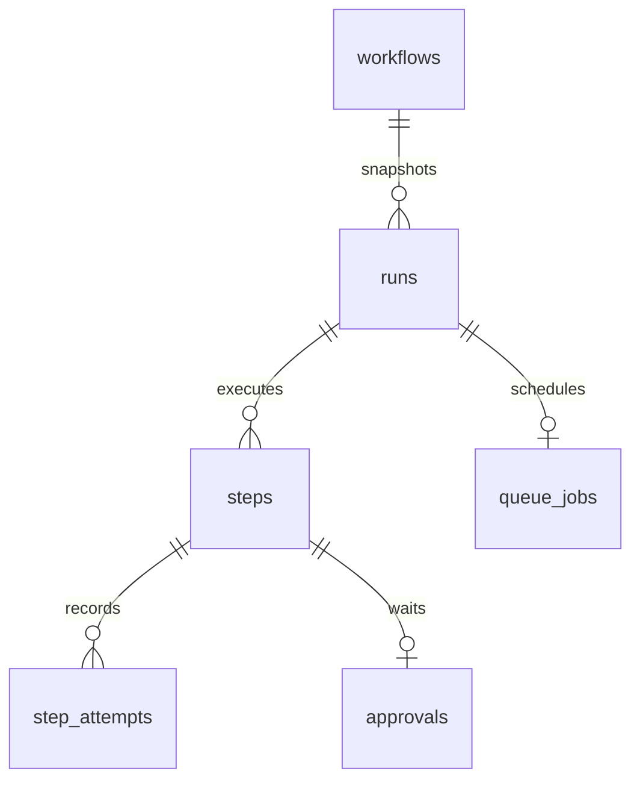

# Relay persistent data model

Task 1.5, 2026-09-25. **Schema and JPA mappings implemented in tasks3.1–3.2; lifecycle services remain later tasks.** This selects storage structure for Java, Spring Boot, JPA and MySQL. Flyway V1 implements this structure in task3.1; database/library versions and documented constraint support are selected in [setup task 2.2](SETUP.md); migration constraints are verified in3.1; repository/locking verification remains3.10.

Sources: [PDF evidence](source-review/brief.txt), [pack data model](source-review/pack/docs/DATA_MODEL.md), [API contract](source-review/pack/docs/API_CONTRACT.md), [implementation guide](source-review/pack/docs/IMPLEMENTATION_GUIDE.md), [catalog](source-review/pack/data/node_catalog.json), [requirements](REQUIREMENTS.md), [architecture](ARCHITECTURE.md), [roadmap](../PROJECT_PLAN.md). The pack's suggested entities are retained; separate attempts and queue ownership fields implement their required durability and trace guarantees. The guide explicitly permits sequence in keys for loop iterations.

## Storage conventions

Use InnoDB transactions and foreign keys. IDs are opaque, case-sensitive strings, including the supplied workflow IDs. Planned SQL type is VARCHAR(128) with a binary utf8mb4 collation; validate length before persistence and never truncate. Generated run/approval IDs use prefixes plus UUIDs within that bound. Node IDs use the same storage type but follow the path-safe grammar in [workflow semantics](WORKFLOW_SEMANTICS.md); they reference nodes inside JSON, not a separate node table. Name/description use TEXT; resolved approval messages use LONGTEXT to accommodate the 1 MiB semantic limit without truncation. Structured errors use JSON. Task 1.7 specifies definition/input/parameter limits; transport result limits remain route/adapter work. Do not impose an undocumented small bound on seed JSON.

JSON columns preserve canonical definition/input/output shapes; SQL NULL means unavailable, whereas JSON null is a stored value. Required JSON documents cannot be SQL NULL. Application validation enforces JSON object/schema shape; JSON storage alone cannot validate catalog semantics. Use BIGINT for sequences, counters, revisions and milliseconds, with nonnegative checks; sequences and attempt numbers start at 1. Use DATETIME(6) in UTC for timestamps, Instant in Java and one UTC convention for both processes. Durations record elapsed execution time; durable waiting is visible separately through timestamps. Unknown duration/usage is NULL, never an invented zero.

All listed fields are NOT NULL unless marked `?`. `?` denotes SQL-nullable. Tables have primary keys as stated. Status strings use VARCHAR(32), not ordinals. Fixed allowed values get database CHECK constraints on selected MySQL 8.4; internal state sets are finalized in 1.6 before migration. No physical deletion API is required. All foreign keys use RESTRICT; local database reset is an explicit maintenance operation, not cascading deletion during execution.

## Relationships

One mutable queue slot per run is sufficient for the sequential engine. Historical execution/attempt evidence lives in steps, not a queue event log. No schedules, numbered publication history, tenants, parallel branches or extra product entities are introduced.

## workflows

| Field | Type | Meaning |
| --- | --- | --- |
| id | ID, PK | Canonical external workflow ID; unique and immutable. |
| name, description? | TEXT | Current draft metadata; definition remains canonical for execution. |
| status | status | draft or published; edit sets draft and blocks new triggers until publish (task 1.7). |
| draft_definition | JSON | Editable complete seed-shaped definition. |
| published_definition? | JSON | Last validated frozen publication, copied atomically at publish. |
| published_at? | timestamp | Time corresponding to the current frozen publication. |
| revision | counter | JPA optimistic revision for edit/publish lost-update protection. |
| created_at, updated_at | timestamp | Workflow metadata. |

`published_definition` and `published_at` must be both absent or both present. Published status requires a publication. Editing may never mutate the stored publication in place. Republish replaces it atomically with a new validated copy; old runs own their copies. Task 1.7 selects status draft after every edit, blocking new triggers until validated republish. Repeated publish of an unchanged already-published definition is a no-op; existing runs remain unaffected. Publication and trigger acceptance serialize on the workflow row so a run never receives a mixture of definitions/secrets. IDs inside definitions must match the row ID (service validation).

Webhook secret remains at its canonical path inside draft/publication JSON; a separate independently mutable secret column would risk disagreement. Webhook authentication uses the same publication read for acceptance. Existing snapshots retain the full frozen definition, including its original secret, under restricted backend access. Secrets are never returned through raw entity serialization.

## runs

| Field | Type | Meaning |
| --- | --- | --- |
| run_id | ID, PK | New identity for every accepted trigger. |
| workflow_id | ID, FK workflows.id | Origin; immutable. |
| definition_snapshot | JSON | Immutable deep copy of accepted publication. |
| execution_policy | JSON | Immutable validated policy_version=1, retry/deadline/lease settings at acceptance; see task 1.8. |
| input | JSON | Immutable trigger body, used as trigger.body. |
| trigger_type | status | manual or webhook; schedule excluded. |
| status | status | queued, running, waiting_approval, succeeded, failed, cancelled. |
| current_node_id? | ID | Cursor into snapshot; not a live-workflow FK. |
| steps_executed | counter | One reservation per admitted logical visit; retries/waits do not increment (task 1.7). |
| next_step_sequence | positive counter | Next logical execution identity; allocated under run lock. |
| ai_tokens_used? | counter | Known token total; NULL if no usage known. |
| ai_usage_complete | boolean | False if an AI call's usage is unavailable, including uncertain crashes. |
| error? | JSON | Structured failure/cap/node reason; sanitized on read. |
| cancel_requested_at?, cancel_requested_by?, cancellation_reason? | timestamp, TEXT, TEXT | Durable cooperative cancellation request/evidence. |
| created_at, started_at?, finished_at? | timestamp | Acceptance, first execution, terminal completion. |
| revision | counter | Optimistic conflict detection, supplements shared run lock. |

No incoming webhook deduplication key is introduced: two accepted requests create two runs. `next_step_sequence` is not the cap counter; retry and wait recovery must not accidentally allocate a new logical step. Run snapshot/input are immutable service fields, not editable entity setters. The six public statuses are fixed. A cancellation request can coexist with an in-flight step until the between-step check; cancellation does not require an invented public status. NULL usage means unknown, not free execution. Totals reflect recorded calls only and must not double-count repeat completion callbacks.

## steps

| Field | Type | Meaning |
| --- | --- | --- |
| run_id, sequence | composite PK; run FK | Identity of one logical node execution, including one loop visit. |
| node_id, node_type | ID, status | From run snapshot; catalog validated by service. |
| status | status | running, waiting, succeeded, failed, cancelled; transitions in task 1.6. |
| wait_reason? | status | delay, retry or approval exactly when status is waiting; NULL otherwise. |
| final_attempt | counter | Highest allocated attempt number, initially 0 before dispatch. |
| resolved_input? | JSON | Frozen parameters once successfully resolved, before any side effect. |
| dispatch_request? | JSON | Concrete method, destination, headers/body (including serialized body bytes encoded for JSON storage) or provider request context needed for replay; NULL for pure nodes. |
| output? | JSON | Successful output; AI output only after schema validation. |
| error? | JSON | Last/terminal failure including resolution errors. |
| idempotency_key? | VARCHAR(320), binary | Unique persisted key for notify, order_action and non-GET http_request. |
| selected_next_node_id? | ID | Persisted chosen successor; NULL may mean terminal, distinguished by step status. |
| resume_at? | timestamp | Original durable delay deadline; never reset on restart. |
| ai_repair_count | counter | 0 or 1; separate from transport retry count. |
| ai_repair_request? | JSON | Persisted provider repair request/validation feedback when repair count becomes 1; NULL before. |
| tokens_prompt?, tokens_completion? | counter | Sum of known AI usage for this logical step. |
| ai_usage_complete | boolean | Whether all relevant AI usage is known. |
| started_at?, finished_at?, duration_ms? | timestamp, timestamp, counter | Logical step timing, including durable wait interval if completed. |

`UNIQUE (idempotency_key)` prevents accidental key reuse across distinct effects; non-effect rows keep it NULL. Choose `{run_id}:{sequence}` as a stable equivalent key: unique across loop visits, unchanged across attempts/restarts, safely within the column bound and free of delimiter ambiguity from arbitrary node IDs. This follows the guide's stable-equivalent allowance. Never include attempt number. Persist resolved input, concrete request and key together before sending; recovery must not re-resolve a changed environment URL or previous-node output. Deployment credentials for provider transport remain external configuration; business request data is frozen.

No uniqueness on `(run_id, node_id)`: a loop must create a new sequence. No SQL FK from node_id to a live definition. The service validates node/type/next against the snapshot and writes completion/output/selected successor atomically. Step identities and successful results are append-mostly: never overwrite a prior loop visit to represent the next one.

## step_attempts

| Field | Type | Meaning |
| --- | --- | --- |
| run_id, step_sequence, attempt_no | composite PK | FK (run_id, step_sequence) to steps (run_id, sequence). |
| status | status | running, succeeded, failed, uncertain; uncertain is a terminal unknown outcome. |
| cause | status | initial, transport_retry, schema_repair, recovery. |
| claim_generation | counter | Queue ownership generation that prepared the attempt. |
| request? | JSON | Per-call request delta/full request, including appended AI validation feedback. |
| output?, error? | JSON | Attempt result or failure; invalid AI response never becomes step.output. |
| provider?, model? | TEXT | AI identity where applicable. |
| tokens_prompt?, tokens_completion? | counter | Provider-reported usage; absent for non-AI/unreported usage. |
| started_at, finished_at?, duration_ms? | timestamp, timestamp, counter | Attempt timing; unfinished call remains visibly uncertain after crash. |

One row per prepared handler/transport invocation (a crash may prevent actual dispatch); delay wake-ups and approval decisions are not additional outbound attempts. Task 1.8 defines recovered uncertain attempts and shared retry reservations in [recovery protocol](RECOVERY.md). Record provider and model before calling; unavailable post-crash token usage cannot be reconstructed or fabricated. Attempt allocation and final_attempt update commit together. Persist the schema-repair count/request before calling so restart cannot reset the one-repair allowance. No second repair or ordinary retry may bypass terminal schema failure.

## approvals

| Field | Type | Meaning |
| --- | --- | --- |
| id | ID, PK | External approval identity. |
| run_id, step_sequence | composite FK steps | Exact approval-node loop visit, not just its node ID. |
| node_id | ID | Snapshot node ID; must match referenced step via service validation. |
| message | LONGTEXT | Frozen resolved text shown to human. |
| status | status | pending, approved, rejected, closed; closed means administrative cancellation without a human decision. |
| created_at | timestamp | Request creation. |
| decided_by?, decided_at? | TEXT, timestamp | Authenticated human decision evidence. |
| closed_at?, close_reason? | timestamp, TEXT | Administrative closure, e.g. run cancellation, without fabricating rejection/decider. |

`UNIQUE (run_id, step_sequence)` ensures one approval per logical visit despite recovery. `decided_by` and `decided_at` must be both absent or both present; approved/rejected requires both. Human decisions are immutable. A pending inbox/action predicate must include `closed_at IS NULL`; cancellation closure can never remain actionable. Task 1.6 selects closed status: closed requires closure time/reason and NULL decision fields; all other states require NULL closure fields. Pending requires NULL decision fields. Do not claim cancellation was a human rejection.

The engine gate queries this run for approved, decided evidence at `step_sequence < current sequence`; a pending, rejected, closed-without-decision or other-run record cannot authorize an action. Service validates referenced step is an approval node. Only the authenticated decision service writes human decision fields; model output cannot write these tables. Run locking serializes approval/cancellation/completion; row uniqueness alone does not establish race correctness.

## queue_jobs

| Field | Type | Meaning |
| --- | --- | --- |
| run_id | PK and FK runs.run_id | At most one durable queue slot per sequential run. |
| step_sequence? | counter | Composite FK (run_id, step_sequence) to steps; NULL only before logical-step preparation. |
| target_node_id | ID | Snapshot node to execute/resume; validated against run cursor. |
| status | status | ready, leased, inactive; only leased has owner/lease values. |
| available_at | timestamp | Durable due time for initial work, retry or delay continuation. |
| lease_owner?, lease_until? | TEXT, timestamp | Recoverable ownership, both set or both NULL. |
| claim_generation | counter | Monotonically increased on each new claim/reclaim; never reset. |
| retry_count | counter | Prepared additional transport/recovery attempts for current step; below stored M, reset only on new step. |
| next_attempt_cause? | status | initial, transport_retry, schema_repair or recovery pending preparation; NULL after preparation, during delay/approval wait or terminal state. |
| created_at, updated_at | timestamp | Queue bookkeeping. |

Reuse the same row across steps, increasing ownership generation on claims. Retain it inactive during approval waits and after terminal completion, keeping the generation monotonic for the run lifetime. A new target clears step_sequence until its step is allocated; retries retain it. Persist delay time in steps and mirror it into available_at atomically. Terminal/waiting runs have no eligible runnable job. An approval decision enables this slot exactly once in the same transaction as the decision/run update. Ownership checks include run, generation, expected target/sequence and lease; delayed callbacks cannot update a reused slot. Lease timing, renewal, lock order and conditional SQL are defined in [recovery protocol](RECOVERY.md), not claimed implemented here.

## Constraints and indexes

| ID | Table | Constraint/index | Query or invariant |
| --- | --- | --- | --- |
| C01 | workflows | PK (id); publication pair CHECK | Duplicate workflow IDs rejected; no published status without JSON. |
| C02 | runs | PK (run_id); FK (workflow_id); status CHECK | Known workflow; six public run states only. |
| C03 | steps | PK (run_id, sequence); FK (run_id); UNIQUE (idempotency_key) | Ordered trace and distinct logical effects. |
| C04 | step_attempts | PK (run_id, step_sequence, attempt_no); composite FK to steps | Unique attempts attached to same-run step. |
| C05 | approvals | PK (id); UNIQUE (run_id, step_sequence); composite FK to steps; decision pair CHECK | No duplicate approval for a loop visit or partial human identity/time. |
| C06 | queue_jobs | PK (run_id); FK to runs; composite FK to steps; lease pair CHECK | One queue slot, same-run step ownership. |
| I01 | workflows | (created_at, id) | Stable workflow listing. |
| I02 | runs | (created_at, run_id); (workflow_id, created_at, run_id); (status, created_at, run_id) | Global/history/status listing; combined filters may use one and filter remainder. |
| I03 | steps | (run_id, node_id, sequence) | Latest prior output lookup; primary key already serves ordered trace. |
| I04 | approvals | (status, closed_at, created_at, id) | Pending actionable inbox. |
| I05 | approvals | (run_id, status, step_sequence) | Earlier same-run approval gate and run closure scan. |
| I06 | queue_jobs | (status, available_at, run_id) | Due ready work ordered by due time and stable ID. |
| I07 | queue_jobs | (status, lease_until, run_id) | Expired ownership scan, separate from due-work scan. |

All counters have nonnegative CHECKs; sequence/attempt identities are positive; ai_repair_count is bounded to 0..1. Timestamp ordering checks apply when both timestamps exist. Task 1.6 requires finished_at on terminal runs/steps and NULL on nonterminal ones; terminal steps also require duration_ms. Known succeeded/failed attempts require finish/duration, while running/uncertain attempts keep both NULL. Waiting steps require wait_reason; other steps require NULL. Leased jobs require owner/lease; ready/inactive require both NULL. These are row-local CHECKs; cross-table lifecycle invariants require service transactions. Foreign-key supporting indexes not covered by prefixes above are explicitly created by migrations. Do not index entire JSON or add speculative status combinations: verify query plans on real MySQL in 3.10 and add only indexes justified by implemented routes. Pagination is a route decision, not a newly fixed API shape.

## Transaction and enforcement boundaries

Database enforces keys, same-run FK relationships, nullability and local CHECKs. Services enforce snapshot immutability, JSON/schema semantics, node membership/type, transitions, cap accounting, human authorization, and synchronized run/step/job state. Constraints do not replace authentication, locking or stale-owner checks.

1. Publish locks/checks workflow revision, validates and copies draft to publication. Trigger acceptance authenticates that publication and commits snapshot/input/run plus initial job together. Failed transactions leave neither accepted run nor orphan work.
2. Preparation locks run and owned job, checks cap/gate/cancellation, allocates or reuses step/attempt and persists request/key before network activity. Network calls occur outside database transactions.
3. Completion conditionally verifies ownership/run state, commits attempt/step output, timing/usage, cursor and next job or terminal state together. Failed completion leaves recovery with the persisted key/request; no downstream node runs first.
4. Wait creation commits approval plus waiting state and inactive job, or delay deadline plus scheduled job. Decision/rejection/cancellation commits evidence, run state and job changes together. Duplicate commands cannot create a second continuation.

JPA entities use explicit field mappings, string enums and @Version where revision is listed. Composite identifiers need value objects and explicit same-run join mappings. Disable automatic schema generation; Flyway owns constraints. Use short application transactions and explicit run locks for multirow invariants; native queue SQL is permitted by A02. Avoid eager traversal of large JSON/attempt histories: trace queries load ordered pages/projections. Controllers never serialize JPA entities. ORM mappings and SQL locks must be verified against actual MySQL, not an H2 approximation.

## Secrets and trace storage

Persist raw execution data only where replay/schema validation needs it: snapshots, resolved inputs, dispatch requests, and attempt results may contain supplied credentials or personal data. These are backend-only local database records, retained until explicit local reset; no separate raw prompt console logs. Do not put platform demo tokens or deployment provider keys in persisted requests. Provider authorization is attached at dispatch from server configuration. User-supplied HTTP credentials may need storage in the frozen request for deterministic replay; protect local DB access and redact projections.

Trace projection recursively redacts known credential keys (case-insensitive Authorization, Proxy-Authorization, Cookie, Set-Cookie, X-Relay-Secret, api_key, secret, password, token), removes URL userinfo and masks credential query values; scrub known configured secret values from messages/errors. Never expose draft/publication/snapshot wholesale. Apply the same policy to inputs, outputs, invalid AI bodies, headers and error details. Preserve nonsecret resolved values and validated outputs required for traces. Arbitrary user text can contain unidentified secrets: this is a documented local-demo limitation, not a promise of perfect data-loss prevention. Redaction tests in 6.2 include nested fields, query credentials, response headers and echoed errors. UI escaping treats messages/model text as data.

## Verification and deferred decisions

| Case | Prerequisites and action | Expected result and future owner |
| --- | --- | --- |
| T01 | Published seed; accept run A, edit/republish, accept B. | A snapshot unchanged; B matches newly accepted publication; invalid publish cannot replace it. 3.8, 3.10; V03. |
| T02 | Run and logical step exist; insert duplicate sequence/attempt/key; attach missing or other-run step to approval/job. | Constraint rejection; no partial transaction survives. 3.10; V06. |
| T03 | Loop visits same node twice; retry first visit after post-effect crash. | Two sequences/keys; retry uses first persisted key/request; prior output/attempt retained. 4.11, 4.14; V07, V10. |
| T04 | Pending approval; race approve/reject/cancel and repeat decisions. | One consistent decision/closure, at most one continuation, no pending inbox leak, no fabricated decider; precedence defined in task 1.6. 5.2, 5.3, 5.11; V12, V17. |
| T05 | Expired lease, scheduled delay, stale completion and DB failure during commit. | Due/recovery scans find correct work; generation fences old writer; deadline survives; atomic rollback. 4.3, 4.5, 4.8, 4.14; V06, V10. |
| T06 | Invalid AI response then repair; crash; response lacks token usage. | Repair budget survives; invalid data never enters output context; unknown usage stays unknown. 5.7, 5.8; V14, V18. |
| T07 | Same-run approved earlier gate versus later/other-run/pending/forged approval; cap near boundary across restart. | Only legitimate earlier evidence passes; persisted budget cannot reset. Counting defined in task 1.7: one per admitted visit, final success at cap allowed. 5.4, 4.13; V13, V16. |
| T08 | Secrets in nested input, headers, URL and echoed errors; trace/history reads. | Nonsecret traces remain useful, credentials hidden, ordering stable. 6.1, 6.2; V18. |

These are future repository/engine tests, **not executed**. Task 1.5 checks document structure, source alignment and counterexamples only. Run `python3 scripts/check_data_model.py` from the root; results are saved in [data-model-verification.txt](data-model-verification.txt). Manual review covers all eight scenarios above against the selected columns and invariants, without asserting database behavior.

Task 1.6 defines state sets, cancellation closure/races and terminal timing in [STATE_TRANSITIONS.md](STATE_TRANSITIONS.md). Task 1.7 defines publication eligibility, template output semantics and exact step-cap counting in [WORKFLOW_SEMANTICS.md](WORKFLOW_SEMANTICS.md). Task 1.8 defines locking/lease/fencing/retry budgets and recovery SQL in [RECOVERY.md](RECOVERY.md); migration checks now run against real MySQL in3.1; repository/locking checks remain3.10. D01 resolved on 2026-09-28 (preserve supplied graph and enforce approval gates): the injection fixture's unconditional-pause expectation conflicts with its conditional graph; storage design does not force a branch. No API routes changed; schema enforcement alone does not establish engine correctness, and no optional version history/schedule execution added. Keep all work local; never push or publish.

## Implemented migration — task3.1

[V1__relay_schema.sql](../backend/src/main/resources/db/migration/V1__relay_schema.sql)
creates the six approved tables. Each uses InnoDB/utf8mb4_0900_bin, case-sensitive
VARCHAR identifiers/statuses, JSON, BIGINT counters and DATETIME(6). Booleans have
explicit0/1 checks. Optional nonnegative counters allow SQL NULL. Required state
pairs use explicit IS NULL/IS NOT NULL predicates so MySQL CHECK's UNKNOWN result
cannot accidentally admit a missing decision, lease, wait reason or finish time.
AI repair count/request presence is paired; node types and JSON object/schema
semantics remain service validation. No application records are seeded by migration.

Indexes implement I01–I07 plus explicit composite-FK support. Every foreign key
uses RESTRICT for update/delete; no cascade and no default lifecycle values.
A nullable queue step still has a separate run FK. Case-distinct IDs can coexist;
utf8mb4_0900_bin uses NO PAD semantics. UTC timestamps are a writer convention,
not a timezone conversion performed by DATETIME storage.

Run `python3 scripts/check_component_startup.py --domain` after rebuilding the jar.
[SQL assertions](../scripts/schema_assertions.py) cover metadata, valid loop visits,
nullable keys, requiredJSON/invalidJSON, SQLNULL versus JSONnull, foreign keys,
uniqueness, state/timing/evidence/lease/counter checks, restrictive deletion and rollback.
The checker uses packaged classpath Flyway migration in a disposable real MySQL
instance and also tests worker startup, database outage/recovery and API restart.
Results: [schema verification](domain-schema-verification.txt).
The broader T01–T08 repository/engine scenarios above remain future integration work.

## JPA foundation — task3.2

The persistence package maps every V1 column with explicit field access, type and
nullability. Workflow/run revisions use @Version; StepId and StepAttemptId have
value equality. Scalar foreign-key IDs avoid eager entity graphs; MySQL still
provides same-run relationship enforcement. Internal repositories do not provide
authorization or lifecycle transitions.

Lowercase enums persist as VARCHAR. JSON uses String plus Hibernate JSON JDBC
binding: Java null is SQL NULL, string "null" is JSON null. Instant uses TIMESTAMP
JDBC binding to DATETIME(6), with hibernate.jdbc.time_zone=UTC. Identity and run
snapshot/input/policy columns are not ORM-updatable. No public raw-state setters
are provided; required constructors create initial records. These restrictions do
not replace service validation or protect against direct SQL.

Validation covers required fields, Unicode code-point identifier bounds and numeric
storage bounds. Full workflow schema/catalog validation remains later work. Explicit
summary DTOs exclude definitions, requests and credentials; entities are not API
responses. Migration state checks remain authoritative for row-local combinations.

`python3 scripts/check_persistence.py` runs the explicit Gradle mysqlTest on disposable
MySQL: all six repositories, composite identities, JSON/null, UTC microseconds under
a non-UTC JVM, FK failure/rollback and workflow/run optimistic conflicts. Ordinary
unit tests exclude this class; mysqlTest fails without its required DB environment.
Full repository query plans and queue concurrency remain3.10. Evidence:
[persistence verification](persistence-foundation-verification.txt).

Task3.8 implementation update: publication copies and per-run definition/input/policy
snapshot ownership now have service and real MySQL verification. No schema migration
was needed; the existing immutable JPA mappings and workflow revision support these
boundaries. Actual authenticated trigger acceptance with an initial queue job remains4.1/4.2.
Evidence: [publication verification](publication-verification.txt).

### Phase5 implementation update (2026-09-28)

AI and approval execution and human control are now implemented. The worker persists
pending approval/step/run/job state atomically and releases ownership. Human decisions
serialize with cancellation and worker results on the run lock. Approved earlier same-run
human evidence is checked on every sensitive attempt; AI output cannot create that evidence.
Strict output JSON/schema validation permits one durable corrective request. Transport and
recovery use the original shared retry budget, provider/model and frozen request; lost
usage is explicitly incomplete. Cancellation prevents new dispatch/retry/repair/successors
and preserves a known in-flight result before cancelling the run.

D01 was clarified by the user on2026-09-28: retain the supplied graph, refund_request pauses
for approval, complaint/question follows notification, and always block unapproved sensitive
actions. Earlier design-stage statements about an open discrepancy are historical. No
canonical pack bytes or seed graphs were changed. See [API contracts](../API_DOCUMENTATION.md),
[setup](SETUP.md) and [actual evidence](phase5-verification.txt).
Run-read/trace projections and interactive console data remain Phase6.
