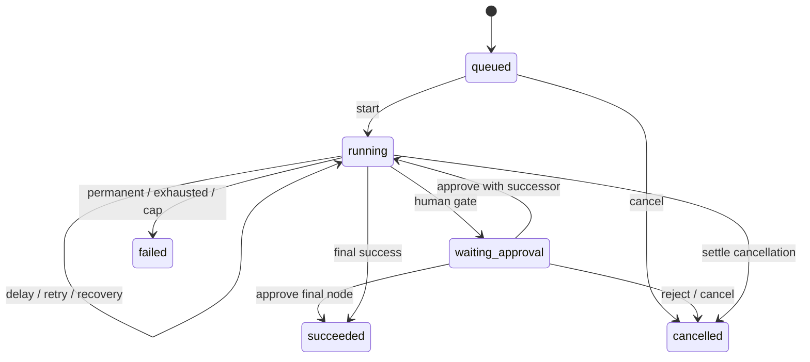

# Relay state transitions

Task 1.6, 2026-09-25. **Design only; no application or runtime verification.** Sources: [PDF evidence](source-review/brief.txt), [API contract](source-review/pack/docs/API_CONTRACT.md), [pack data model](source-review/pack/docs/DATA_MODEL.md), [catalog](source-review/pack/data/node_catalog.json), [implementation guide](source-review/pack/docs/IMPLEMENTATION_GUIDE.md), [architecture](ARCHITECTURE.md), [data model](DATA_MODEL.md), [requirements](REQUIREMENTS.md), [roadmap](../PROJECT_PLAN.md). Fixed run statuses and cancellation requirements come from the API contract. Internal states and ordering below are selected design decisions, not additional product features.

## State vocabulary

| Entity | States | Terminal states |
| --- | --- | --- |
| Run | queued, running, waiting_approval, succeeded, failed, cancelled | succeeded, failed, cancelled |
| Step | running, waiting, succeeded, failed, cancelled | succeeded, failed, cancelled |
| Attempt | running, succeeded, failed, uncertain | succeeded, failed, uncertain |
| Job | ready, leased, inactive | none |
| Approval | pending, approved, rejected, closed | approved, rejected, closed |

Run `queued` means accepted but never started. `running` includes delay/backoff waits and resumed work, not continuous CPU use. `waiting_approval` exclusively means a persisted actionable human request. No new public run status is added. Step `waiting` has required `wait_reason` = delay, retry, or approval. Other step states have NULL wait_reason. Job `inactive` is reused after approval, but never reactivated for a terminal run. Closed approval is administrative closure, not a human rejection; this extra internal state implements the contract's cancellation closure. Attempt causes are initial, transport_retry, schema_repair, recovery.

## Guard and transaction rules

Every event below is a short database transaction or an outcome committed by one. All mutations of a run's execution serialize on that run, rechecking current state after acquiring ownership. Worker writes additionally require current job generation, lease and target/sequence. Task 1.8 specifies SQL, lock order, deadlines and renewal in [recovery protocol](RECOVERY.md). Network calls happen outside database transactions. Only committed state authorizes the next action; a rollback publishes no transition. After a committed cancel request, cancellation settlement takes precedence over run success/failure and all new dispatch/wait/continuation events; the current invocation may only record its own result before settlement.

A table row authorizes a transition only with its guard satisfied. Unlisted edges are forbidden. `new` means creation, not a persisted status. Same-state events update evidence or ownership, not a fresh run/step identity. Terminal rows never reopen; repeated/stale completion is a no-op after checking persisted identity, with no token double-counting or successor scheduling. A conflicting result cannot replace committed output. API commands against terminal/nonactionable resources return a conflict, not silent success.

## Run transitions

| From | Event | To | Guard and atomic effects |
| --- | --- | --- | --- |
| new | accept | queued | Authorized valid trigger of eligible publication; snapshot/input/run and ready initial job commit together before acknowledgement. |
| queued | start | running | Due job claimed; cancellation absent; set started_at once, prepare first logical step subject to cap/gate checks. |
| queued | cancel_queued | cancelled | Cancel command wins serialization before start; no step executes, job inactive, cancellation evidence and finished_at set. |
| running | continue | running | Current step succeeds with successor, no cancellation; commit output/chosen edge and ready next work together. |
| running | wait_delay | running | Valid delay prepared; step waiting/delay, original resume_at and ready job due time persisted; release lease. |
| running | wait_retry | running | Retryable failure or first schema validation failure with budget; record failed attempt and waiting/retry step plus due job. |
| running | resume_work | running | Due delay/retry or recoverable lease; use same logical step/key/request; no duplicate cap allocation. |
| running | request_approval | waiting_approval | Resolved approval node, no cancellation; one pending approval, waiting/approval step, inactive job. |
| running | finish | succeeded | Final step succeeds, no successor and no prior committed cancellation; finish run and inactivate job atomically. |
| running | fail | failed | Permanent error, denied gate, invalid template, second invalid AI result, retry exhaustion or cap denial; persist reason and any current step outcome, inactivate job. |
| running | request_cancel | running | A leased execution may be in flight; persist first cancel request/actor/reason, retain current ownership until completion or recovery. No new attempt may start after observing request. |
| running | settle_cancel | cancelled | No active dispatch, or current dispatch completes/fails, or recovery handles abandoned ownership; close unfinished step, stop retries/next nodes, inactivate job, finish run. |
| waiting_approval | approve_continue | running | Authenticated pending decision, no cancellation; approval approved with decider/time, step succeeds with output, ready successor job. |
| waiting_approval | approve_finish | succeeded | Same as approval above but no successor; step succeeds, job stays inactive, run finishes. |
| waiting_approval | reject | cancelled | Human rejection recorded; approval step succeeds with rejected decision output, cancellation reason approval_rejected, job inactive. |
| waiting_approval | cancel_wait | cancelled | Approval closed without human decision, step cancelled, job inactive, cancellation evidence set. |

An approved final approval node completes the run; it does not enqueue an empty target. Rejection is a successfully obtained human decision at the step level but cancels the run and follows no edge. No `queued` transition on approval or retry: started_at remains the original start. Failure before node admission (e.g. cap) can terminate the run without inventing an extra executed step. Malformed parameters discovered after step allocation fail that step with clear error. Task 1.7 defines admission/counter boundaries in [workflow semantics](WORKFLOW_SEMANTICS.md): reserve once before resolution/gating; retries reuse that reservation; cap denial creates no extra step.

## Step transitions

| From | Event | To | Guard and atomic effects |
| --- | --- | --- | --- |
| new | allocate | running | New logical visit under run lock; sequence allocated once, started_at set; initialize attempt counter to 0. |
| running | complete | succeeded | Valid output and current ownership; persist selected successor and completion timing. |
| running | fail | failed | Permanent/exhausted failure; store reason and timing; run fails unless cancellation already won. |
| running | yield | waiting | Set wait_reason and durable delay deadline, retry schedule, or pending approval with matching run/job updates. |
| waiting | retry_due | running | wait_reason retry, due and claimed, budget available, no cancellation; allocate fresh attempt, reuse step/key. |
| waiting | delay_due | succeeded | wait_reason delay and resume_at reached under valid ownership; no new node visit/attempt; persist empty delay output and successor. |
| waiting | decide | succeeded | wait_reason approval; authenticated approved/rejected decision committed with output decision/decided_by. Rejected follows no successor. |
| running | recover | running | Reclaimed step retains identity; abandoned attempt becomes uncertain and yields waiting/retry through the yield event before any replacement attempt; do not reset counters. |
| running | cancel | cancelled | Cancel before dispatch or recover without replay after cancellation; unknown remote result retained in attempt evidence. |
| waiting | cancel | cancelled | Cancel delay, backoff or human wait; remove wait_reason, close pending approval when present, no successor. |
| waiting | exhaust | failed | Recovery/policy check finds no retry allowance; reason preserved, no outbound attempt. |

A running attempt that returns after a committed cancel request may still settle its step succeeded or failed. The run becomes cancelled and no retry or successor is scheduled. A step cancelled without a known result has no fabricated success output. Each loop visit has a distinct sequence; failed/cancelled logical steps cannot be replayed as a product feature. Waiting transitions never reset the step start time.

## Attempt transitions

| From | Event | To | Guard and atomic effects |
| --- | --- | --- | --- |
| new | prepare | running | Persist request, claim generation and next attempt number before invoking handler/transport. |
| running | valid_result | succeeded | Persist known validated result, usage, finish time and duration with step transition. |
| running | invalid_or_error | failed | Transport error/timeout, handler failure or invalid AI response; preserve sanitized error and known usage. |
| running | abandoned | uncertain | Recovery cannot know whether prepared dispatch ran or returned; record uncertainty, never fabricate output or usage. |

`uncertain` is terminal for that attempt, not proof that the remote action failed. Recovery allocates another attempt if allowed; late completion of the old one is fenced out. For uncertain attempts finished_at/duration_ms remain NULL because actual finish is unknown; store recovery observation in error metadata. Known succeeded/failed attempts require finished_at/duration_ms. Local deterministic handler invocations can have attempts; approval decisions and delay wake-ups do not create new ones. If the initial approval/delay handler yields successfully, its preparation attempt succeeds while the logical step remains waiting. If dispatch preparation committed but the process died before calling, the attempt is still uncertain on recovery.

AI parse/schema failure makes that attempt failed. The first such failure persists ai_repair_count = 1 and the validation feedback before scheduling the repair. A second invalid response fails the logical step/run; ordinary transport retries must not restart the schema-validation budget. Provider transport failure during repair retries the persisted repair request within the transport budget. Only validated AI output can be step.output. Successful transport alone does not make an AI attempt succeeded.

## Job transitions

| From | Event | To | Guard and atomic effects |
| --- | --- | --- | --- |
| new | enqueue | ready | Run acceptance; due time now, no owner/lease, generation 0. |
| ready | claim | leased | available_at reached and run eligible; assign owner/lease, increment generation. |
| leased | renew | leased | Current owner/generation still valid; extend lease under protocol 1.8. |
| leased | reclaim | leased | Expired ownership, old worker stopped for supported recovery; new owner/generation, recover same persisted target. |
| leased | schedule | ready | Persist next node, retry or delay deadline; clear owner/lease; new node clears step_sequence and resets per-step retry_count. |
| leased | pause_or_finish | inactive | Approval wait or terminal run; clear owner/lease. |
| ready | cancel | inactive | Queued, backoff, delay or between-step cancellation; no execution in flight. |
| leased | cancel_recovered | inactive | Authorized recovery sees cancel request; close abandoned attempt, no replay, terminal run. |
| inactive | approve | ready | Only matching pending approval was approved with successor; run becomes running. |

An inactive slot is retained for the run lifetime; claim_generation never decreases or resets when the target changes. Its retained target is historical bookkeeping, not runnable intent. Recovery must inspect run/step state, not blindly dispatch the last target. Job ready/leased is forbidden for terminal runs or waiting_approval. `ready` with future available_at is a durable wait, not lost work. An inactive job on final approval stays inactive. No queue publication outside the domain transaction.

## Approval transitions

| From | Event | To | Guard and atomic effects |
| --- | --- | --- | --- |
| new | request | pending | Approval step waiting, run waiting_approval, one row per run/sequence, job inactive. |
| pending | approve | approved | Authenticated decision; run still waiting on this row; record identity/time; step output and continuation/terminal success atomic. |
| pending | reject | rejected | Same guards; record human identity/time; step decision output and run cancellation atomic. |
| pending | cancel_close | closed | Run cancellation; closed_at and close_reason set, decided_by/decided_at remain NULL. |

Pending/approved/rejected keep closed_at and close_reason NULL; closed requires both. Pending has NULL decision fields; approved/rejected require both. Closed never grants a gate. The inbox selects status pending AND closed_at IS NULL, with a matching waiting run. The engine checks approved evidence from an earlier sequence in the same run for every sensitive action; model text cannot create human evidence. Existing approvals are not revoked by subsequent run cancellation, but a cancelled run cannot execute more actions.

## Cancellation and race precedence

**The first committed transition under run serialization determines what the next command observes.** No last-write-wins update. Rollback does not win a race.

- Cancel versus start: cancel first makes queued terminal with zero executions; start first means running cancellation rules apply.
- Cancel while job ready (including future delay/backoff) or no dispatch is active: settle immediately, cancel any unfinished step and close pending approval. Cancel while job leased: persist request; current authorized invocation may finish/fail, but no further invocation, retry, repair or successor is allowed after the worker observes it. A tiny request/dispatch race can still send the already authorized current invocation; cancellation is cooperative, not remote rollback.
- Cancel versus completion: request commits first → completion may record current result but run ends cancelled, even when that result failed or was final success. Terminal completion commits first → cancel conflicts (409). Nonfinal completion commits first → cancel acts on the new ready/claimed work under the same rules. A later already-admitted node is then the current step, not a retroactively cancelled effect.
- Cancel versus approve: cancel first closes approval and subsequent decisions conflict. Approve first persists immutable decision and one continuation; cancel then stops that running continuation if still ready, or cooperatively cancels current invocation if claimed. If approval was final, the run is succeeded and cancel returns 409.
- Approve versus reject, and duplicate decisions: first decision commits; every later decision, including identical replay, conflicts without new work. Reject records a human decision; cancel records administrative closure. Reject first makes later cancel terminal conflict.
- Duplicate cancel while a leased run already has a pending request: accept as an unchanged pending command, preserve first actor/time/reason. Once terminal, even identical cancellation returns 409 per contract. Success envelope/status for accepted cancellation remains a route implementation choice.
- Worker killed after cancellation request: recovery closes unfinished attempt as uncertain, cancels step/run and inactivates job without resending the request. Remote effect may already exist; trace must state uncertainty, not promise reversal. Uncancelled recovery instead reuses request/key with bounded attempts.

Authentication/authorization is checked before transition, outside these business races. Invalid credentials, malformed requests and missing resources create no state/job/decision. Exact route validation and error vocabulary remain implementation tasks; no live endpoints are claimed here. Losing a response after commit does not undo a decision; clients read state after a conflict or uncertain response. Duplicate triggers remain distinct accepted runs, not duplicate decisions.

## Invariants and recovery boundaries

1. Terminal runs have finished_at, NULL current_node_id, inactive job and no pending approvals/nonterminal steps. Nonterminal runs have NULL finished_at. queued has NULL started_at; started runs keep their first started_at. Queued cancellation may have NULL started_at and a real finished_at.
2. Terminal steps have finished_at and duration_ms; nonterminal steps have neither. Step duration includes persisted waits. Known attempt durations are measured separately; uncertain duration stays unknown. Successful steps have output (including an empty object where catalog expects it); cancelled steps without outcome have NULL output. Rejection output is a decision, not action success.
3. Failed runs have a reason naming failing node/cap where known. Cancellation records actor/time/reason (operator request or human rejection); current-step errors remain visible even if run cancellation takes precedence. Successful runs have no terminal error. Do not clear error history in attempts.
4. waiting_approval has exactly one pending approval and matching waiting/approval step with inactive job. running may have one active step or be between steps. Delay/retry waits use ready due work; leased recovery may temporarily own that waiting step while checking the deadline/budget. No parallel logical executions.
5. Current ownership fences completion, counters, token aggregation and job updates together. State is never advanced solely from an in-memory outcome. DB failure after remote effect leaves old durable state; after restart retry the same frozen request/key only if cancellation absent and budget allows. Receiver idempotency is required; keep mock world alive and old worker stopped. No unconditional exactly-once guarantee for arbitrary receivers.
6. Completed step and successor schedule commit together: before commit recovery sees unfinished step; after commit it sees output plus next intent. Approval creation, decision, rejection and cancellation use the same atomic rule. Restart does not repeat completed nodes, reset delay deadlines, create duplicate approvals or reopen terminals.
7. Recoverable transient errors wait then retry. Permanent template/schema/gate errors do not retry. Exhaustion terminates with clear reason and last attempt evidence. Optional wall-clock/token caps, manual failed-step replay, cron and multi-worker operation remain excluded. Concrete backoff/classification/budgets are 1.8; HTTP/provider mappings implemented in 4.9/5.9.

## Test roadmap and document verification

All runtime cases below are **not run**; prerequisites include implemented migrations, API/worker, controlled clock/provider and MySQL transaction tests. Table events are specifications, not an executable engine.

| Case | Setup and action | Expected result / owners |
| --- | --- | --- |
| S01 | Published valid seed; accept with worker stopped, then start. Inject acceptance commit failure. | queued snapshot/job then running; failed commit creates neither. Tasks 4.1, 4.2; V04, V05. |
| S02 | Finite deterministic path; finish with/without successor, duplicate completion; test loop at cap. | One advancement, terminal absorbing, no extra cap execution; one count per admitted visit per task 1.7. Tasks 4.4, 4.5, 4.13; V06, V16. |
| S03 | Slow fulfillment in delay; restart before/at/after deadline, cancel while waiting. | Same deadline, one logical step, no early continuation; cancellation schedules nothing. Tasks 4.8, 4.14; V10, V17. |
| S04 | Timeout then success, permanent failure, last retry, exhausted budget after restart. | Bounded attempts, persisted backoff, same key, failed terminal on exhaustion. Tasks 4.12, 4.14; V11. |
| S05 | Invalid AI then valid repair; invalid twice; transport fails during repair; restart. | One persisted repair allowance, no invalid downstream output, separate transport budget. Tasks 5.7, 5.8; V14. |
| S06 | Pause approval; approve with/without successor; reject; repeat/conflict decisions. | One decision/output, running or succeeded after approve, cancelled after reject; later decisions conflict. Tasks 5.1, 5.2, 5.3; V12. |
| S07 | Cancel queued, running leased, running ready, delay/retry, waiting_approval and each terminal state. | Rules above; terminal cancel 409; closed approval no longer pending; no invented outcome. Task 5.11; V17. |
| S08 | Barriers force both commit orders for cancel/start, cancel/completion, cancel/approve, approve/reject; rollback winner candidate. | Committed serialization dictates result, at most one continuation; rolled-back transaction has no precedence. Tasks 5.3, 5.11, 4.5; V12, V17. |
| S09 | Crash before dispatch, after effect before commit, after completion commit; replay stale callback. | Uncertain attempt or already committed result preserved; same request/key if retry; stale writes rejected. Tasks 4.3, 4.11, 4.14; V06, V10. |
| S10 | Commit cancel request then kill worker; recover expired lease. | No resend; uncertain attempt, cancelled run/step, inactive job; unknown remote effect reported. Tasks 4.14, 5.11; V17. |
| S11 | Invalid token/body, missing resource, wrong-run/pending/forged approval, invalid template. | No unauthorized state change/effect; distinguish request rejection from runtime failed step. Tasks 3.3, 4.6, 5.4; V02, V07, V13. |
| S12 | Read terminal/uncertain/waiting traces with missing usage and secrets. | Accurate timestamps, outcomes, usage unknowns and redaction; no fabricated success. Tasks 6.1, 6.2; V18. |

Run `python3 scripts/check_state_transitions.py` and the existing architecture/data-model/requirements/MVP/source checkers. The new checker reads transition tables, validates state membership and terminal absorption, checks required events and schema agreement, and rejects mutated documents. Manual review walks S01–S12 and both race orders against the pack. Actual results: [state-transitions-verification.txt](state-transitions-verification.txt). Document checks cannot prove SQL locking or crash safety.

Task 1.7 documents publication/edit semantics, template resolution, branch/loop and precise cap counting in [workflow semantics](WORKFLOW_SEMANTICS.md). Task 1.8 documents the lease/retry/atomic recovery protocol in [RECOVERY.md](RECOVERY.md); SQL/runtime tests remain outstanding. D01 resolved on 2026-09-28 (preserve supplied graph and enforce approval gates); no state machine forces the injection seed into an approval branch. Full API route documentation comes with implementation. All work stays local; never push or publish.

### Phase5 implementation update (2026-09-28)

AI and approval execution and human control are now implemented. The worker persists
pending approval/step/run/job state atomically and releases ownership. Human decisions
serialize with cancellation and worker results on the run lock. Approved earlier same-run
human evidence is checked on every sensitive attempt; AI output cannot create that evidence.
Strict output JSON/schema validation permits one durable corrective request. Transport and
recovery use the original shared retry budget, provider/model and frozen request; lost
usage is explicitly incomplete. Cancellation prevents new dispatch/retry/repair/successors
and preserves a known in-flight result before cancelling the run.

D01 was clarified by the user on2026-09-28: retain the supplied graph, refund_request pauses
for approval, complaint/question follows notification, and always block unapproved sensitive
actions. Earlier design-stage statements about an open discrepancy are historical. No
canonical pack bytes or seed graphs were changed. See [API contracts](../API_DOCUMENTATION.md),
[setup](SETUP.md) and [actual evidence](phase5-verification.txt).
Run-read/trace projections and interactive console data remain Phase6.
